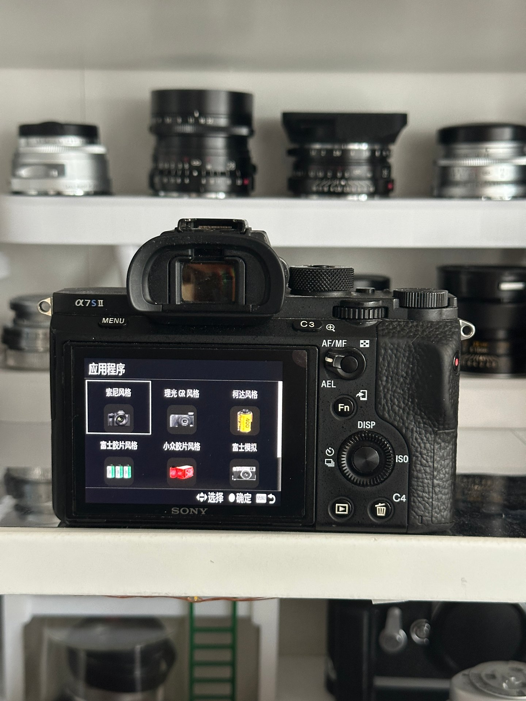
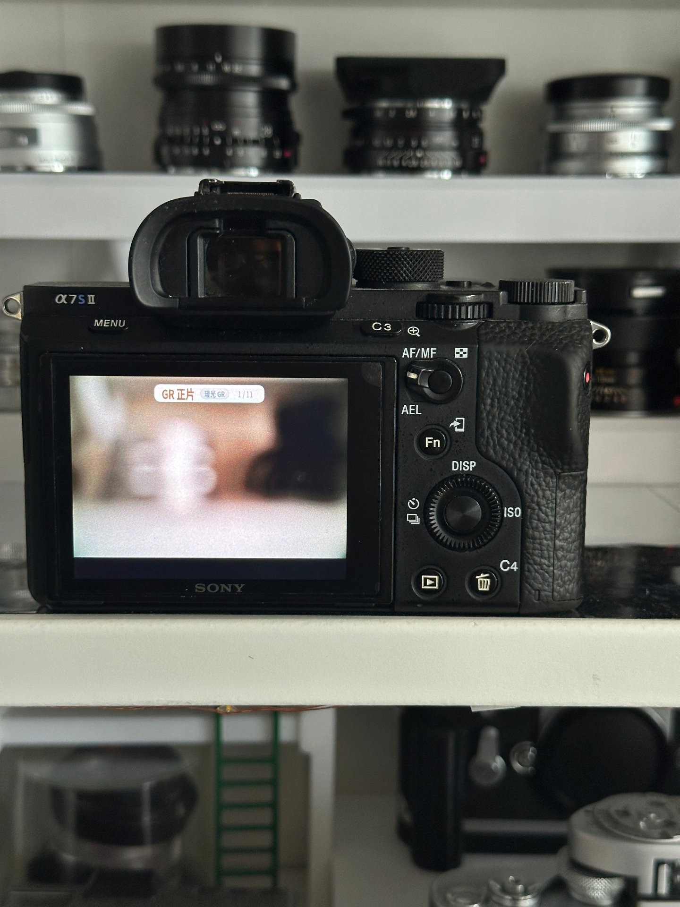
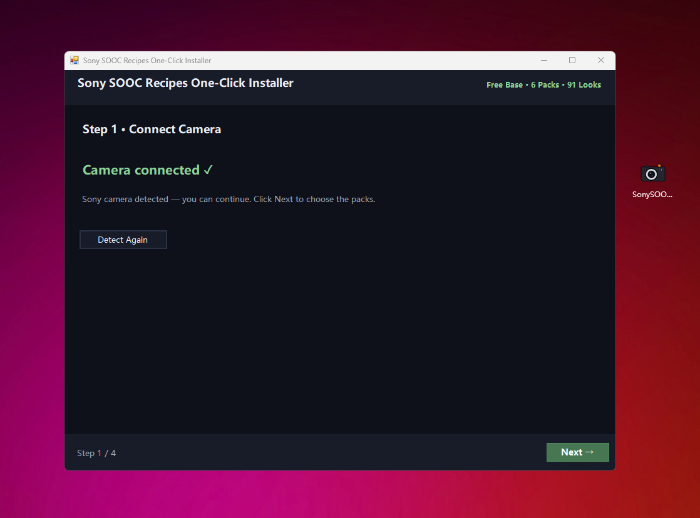
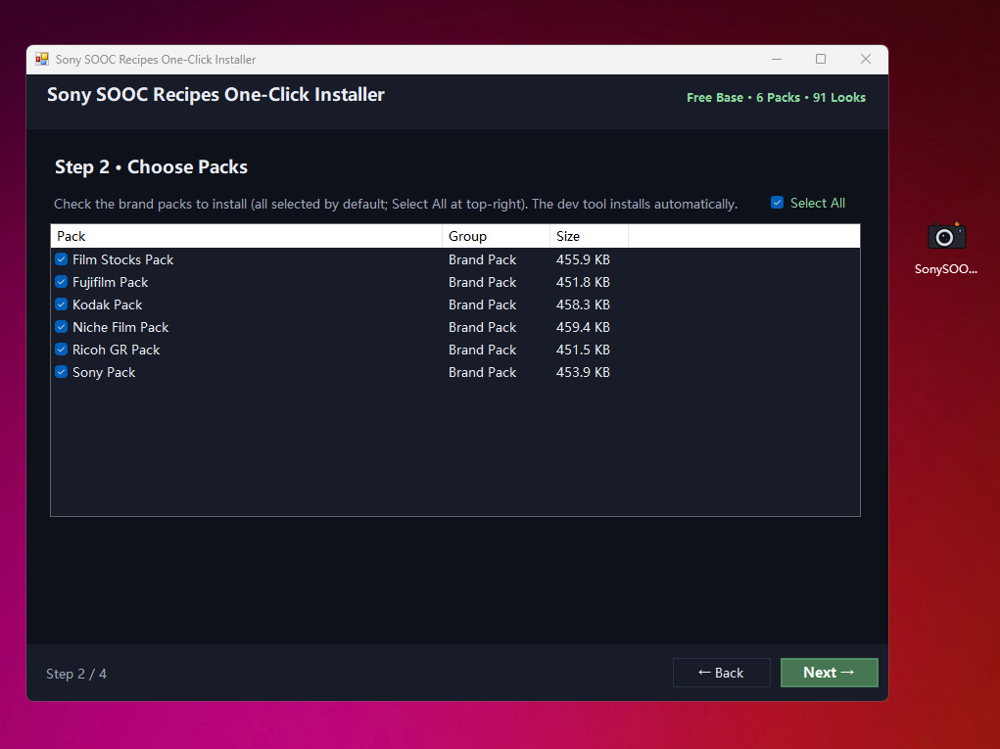
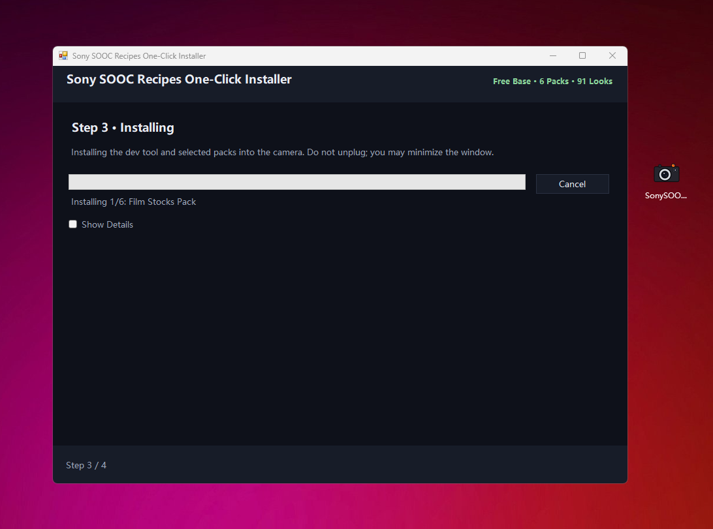
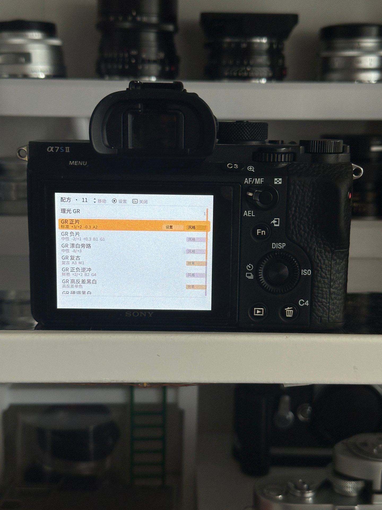
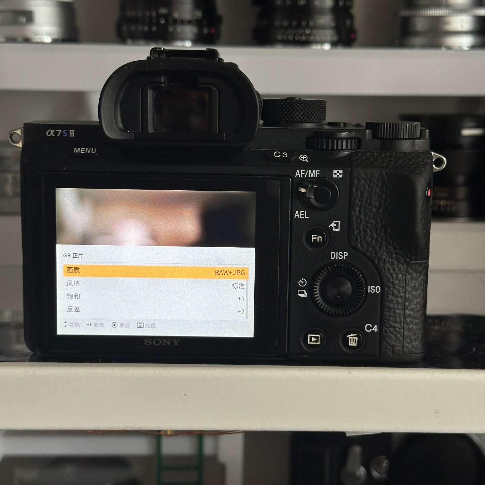

# sony-sooc-recipes

<p align="center">
  <b>English</b> · <a href="README.md">简体中文</a>
  &nbsp;·&nbsp;
  <a href="https://github.com/HairuoLiu/sony-sooc-recipes/actions/workflows/ci.yml"></a>
  <a href="https://github.com/HairuoLiu/sony-sooc-recipes/releases/latest"></a>
  
</p>

<!-- counts: total=164 compiled=149 -->

<p align="center">
  
  
  <br><sub><b>Left:</b> one entry per brand pack, nine of them on one body. <b>Right:</b> open one and you land on a live preview you flip through left/right.</sub>
</p>

**One Windows file, one click.** Download the installer, run it, plug the camera in — it finds the body by itself and writes the looks across USB behind a single progress bar. **No APK to fetch, no toolchain, no command line.** The recipes ship *inside* the installer.
The looks are written into the camera's own settings, so **JPEG or RAW+JPEG both give you a finished SOOC image**: the JPEG carries the look, the RAW stays unstyled, and looks marked **PE** only appear on JPEG.

---

## What film simulations you get

The installer turns your Sony into other cameras. Each **brand pack** is one app that carries that brand's looks under its own name, so they install side by side and you take only the brands you actually shoot.

### Free installer — Base (6 packs, 91 looks)

| Film simulation | Looks | A taste of what's inside |
|---|---:|---|
| Fujifilm Style | 16 | Classic Chrome · Nostalgic Neg · Acros +R |
| Fuji Film Style | 10 | Pro 400H · Reala 500D · Fujicolor Print Industrial 400 |
| Kodak Style | 20 | Portra 400 · Gold 200 · Double-X 5222 · Vision3 |
| Niche Film Style | 26 | Ilford HP5 · Cinestill 50D/800T · Lomochrome |
| Ricoh GR Style | 11 | GR Positive Film · GR Hi-Contrast B&W · Moriyama |
| Sony Style | 8 | FL (film-like) · IN (instant) · VV2 |

The six packs above (91 looks) are **what the free installer carries today**. The project catalogues **164 looks** in all — **149 installable** into a body — and the rest ship gradually once the remaining changes and design testing are done; **the all-in-one app is still under research** and is not released yet. **★ Star this repo** and you'll be notified when it lands.

---

## Install in one click

**One file. One click. No APK, no toolchain, no command line.**

### Step 1 · Download the installer
Download `SonySOOCRecipes-Base-EN.exe` from [Releases](https://github.com/HairuoLiu/sony-sooc-recipes/releases/latest) — the only download there is. *(Reading Chinese? `SonySOOCRecipes-Base-CN.exe` is the same installer in Chinese.)*

### Step 2 · Connect the camera
A charged battery, memory card in, a **data-capable** USB cable, and `Setup → USB Connection → Mass Storage`. Power on, plug in, wait for `USB Mode`.

<p align="center">
  
</p>

### Step 3 · Choose your packs
Run the installer; it finds the camera and lists its packs (all ticked). Untick what you don't want and press **Next**. About **10–15 minutes**; the window can be minimised.

<p align="center">
  
</p>

### Step 4 · Install
Press **Next** and the progress bar runs. About **10–15 minutes**; the window can be minimised.

<p align="center">
  
</p>

### Step 5 · Unplug and shoot
`MENU → Application → Application List` now holds one entry per pack, and the looks are simply how the camera behaves in **P, A, S, M and video**.

> **Windows only.** The installer is a Windows program (Windows 7 SP1 – 11); there is no macOS or Linux build. The pre-built APKs are no longer published — the installer does the same job in place.

Detailed steps, prerequisites and troubleshooting: **[docs/INSTALL.md](docs/INSTALL.md)**.
Before installing, if the body already carries a Sony SOOC Recipes from elsewhere, remove it first — see **[Uninstall](#uninstall)**.

---

## On a real camera

<p align="center">
  
  
  <br><sub><b>Left:</b> open a look to see its recipe — every parameter listed. <b>Right:</b> the parameter editor, with a JPG/RAW switch and fine-tuned controls.</sub>
</p>

**Confirmed on a real α7S II** — installs, launches, nine packs side by side. Photographs in **[docs/INSTALL.md](docs/INSTALL.md)**. The rest of the supported column is *platform* support, not a body-by-body test.

---

<details>
<summary><b>Uninstall</b></summary>

## Uninstall

```
MENU → Application → Application Management → Manage and Remove → pick the entry → remove
```

If that menu item is missing or greyed out, uninstall over ADB
(`adb uninstall com.hairuoliu.sonysoocrecipes.<brand>`). Removing the app does **not** undo a stored look —
to reset colours, in the app press **TRASH** + centre button, power-cycle, or
`Setup → Setting Reset → Camera Settings Reset`. Full flow: **[docs/INSTALL.md](docs/INSTALL.md)**.

</details>

---

## Disclaimer

**Unofficial personal project, not affiliated with anyone.** Not made, endorsed or approved by Sony, nor by Fujifilm, Kodak, Leica, Hasselblad, Ricoh, Pentax or any brand named in a recipe. Every trademark belongs to its owner; names are used only to describe the look a recipe aims at. The recipes are community-derived approximations, not official colour science. Third-party software with no warranty — install at your own risk. If you redistribute, the risk moves to you.
Provenance and licences: **[NOTICE.md](NOTICE.md)** · icons: `assets/app-icon-packs/CREDITS.md`.

---

## Licence

This repository's own code, data structure and documentation: **[MIT](LICENSE)**. Recipe *values* come from upstream and keep the upstream licence — see [NOTICE.md](NOTICE.md). Fifteen matrix looks are recorded by name only and are **not** redistributable.
