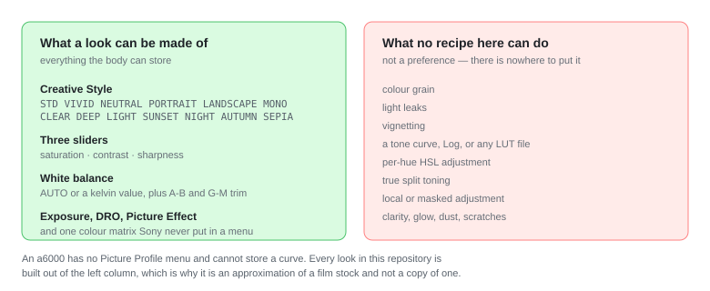

<h1 align="center">sony-sooc-recipes</h1>

<p align="center">
  <b>Film looks, compiled into an APK, installed inside a Sony camera Sony stopped updating.</b>
  <br>
  <sub>117 looks · 102 compiled into the APK · 14 groups · straight-out-of-camera JPEG</sub>
</p>

<!-- counts: total=117 compiled=102 -->
<!-- The line above is checked against catalog/filters.json by CI. Change the catalog,
     change this line — a mismatch fails the build. Do not reword it. -->

<p align="center">
  <b>English</b> · <a href="README.zh-CN.md">简体中文</a>
</p>

<p align="center">
  <a href="https://github.com/HairuoLiu/sony-sooc-recipes/actions/workflows/ci.yml"></a>
  <a href="https://github.com/HairuoLiu/sony-sooc-recipes/actions/workflows/release.yml"></a>
  <a href="https://github.com/HairuoLiu/sony-sooc-recipes/releases/latest"></a>
  
</p>

---

## What this is

Sony shut its PlayMemories Camera Apps store in 2021. Every body made before late 2016
lost its app channel — but those bodies still run an Android userspace, and that means
they can still be given things.

This repository collects the film-look recipes the community has worked out for those
cameras into **one data file**, and builds them into an APK you install once. After that
the look is not an app running in the background — it is simply what the camera does.

Close the app, power-cycle the body, and the look is still there in **P, A, S, M and
video**. Your JPEG comes out of the camera already graded.

> **Honest note.** These are approximations, not copies of anybody's colour science.
> An a6000 has no Picture Profile menu and cannot store a tone curve, so every look here
> is assembled from what the body can actually hold. See
> [what a look can be made of](#what-a-look-can-be-made-of).

---

## Contents

1. [Does your camera work?](#does-your-camera-work)
2. [What a look can be made of](#what-a-look-can-be-made-of)
3. [The looks](#the-looks)
4. [Install](#install)
5. [Using it](#using-it)
6. [How it works](#how-it-works)
7. [Sample gallery](#sample-gallery)
8. [Adding a look](#adding-a-look)
9. [Building the APK](#building-the-apk)
10. [Safety](#safety)
11. [FAQ](#faq)
12. [Where the data comes from](#where-the-data-comes-from)

---

## Does your camera work?

Press `MENU` and look for an **`Application`** entry.

| It has `MENU → Application` | It does not |
|---|---|
| a6000 · a6300 · a6500 · a5100 · a5000<br>a7 · a7R · a7S · a7 II · a7R II · a7S II<br>NEX-5R · NEX-5T · NEX-6<br>RX100 III / IV / V · RX10 II / III · RX1R II<br>HX60 / HX90 / HX400 · WX500<br>a68 · a77 II · a99 II | a6100 · a6400 · a6600 · a6700 · ZV-E10<br>a7 III and everything after it · a9 · a1<br>RX100 VA and later · RX10 IV · RX0 · HX99 · ZV-1 |

**No `Application` entry means nothing fits, and that is final.** Bodies after late 2016
run signed firmware. Not this project, not Sony's own store. Reports of this working on an
a6400 are misreports.

> The same limitation is why these bodies can never have a 4K menu, a Log curve, or an
> in-camera LUT. What is possible is bounded by what the camera can *store*.

---

## What a look can be made of

<p align="center">
  
</p>

A recipe is a set of ordinary camera settings written into persistent storage:

| Field | What it moves |
|---|---|
| `style` | Creative Style — STD, VIVID, NEUTRAL, PORTRAIT, LANDSCAPE, MONO, CLEAR, DEEP, LIGHT, SUNSET, NIGHT, AUTUMN, SEPIA |
| `sat` · `con` · `sharp` | saturation, contrast, sharpness relative to the style's default |
| `matrix` | a second colour matrix Sony never exposed in any menu |
| `wb` | AUTO, or a kelvin value, plus A-B (amber/blue) and G-M (green/magenta) trim |
| `pe` · `sub` | Picture Effect and its sub-mode — **when a Picture Effect is on, the camera ignores Creative Style** |
| `ev` · `dro` | exposure compensation in ⅓ EV steps, and DRO |

Because these are ordinary settings, you can walk into the body menus and see or overwrite
any of them. That is the point: nothing is hidden, and nothing is permanent.

---

## The looks

117 looks in 14 groups. Open **[the filter browser](catalog/index.html)** for the full,
searchable list — it is a single self-contained HTML file, so download it and open it
locally rather than viewing the source on GitHub.

| Group | Count | Representative looks |
|---|---|---|
| **Sony** | 8 | FL (film-like) · IN (instant) · VV2 |
| **Fuji Sim** | 26 | Classic Chrome · Nostalgic Neg · Acros +R |
| **Fuji Film** | 5 | Pro 400H · Superia 400 · Natura 1600 |
| **Kodak** | 15 | Portra 400 · Gold 200 · Ektar 100 · Tri-X · Vision2 500T |
| **Cine** | 4 | Cinestill 800T · Cinestill 50D · Rec709 |
| **Ricoh GR** | 16 | GR Positive Film · High-contrast B&W · Moriyama · Cinema Green/Yellow |
| **Leica** | 6 | Monochrom · Classic · M9 CCD |
| **Hasselblad** | 4 | HNCS Natural · LowSat · HiContrast |
| **Canon / Nikon** | 5 | Canon Faithful · Nikon Flat |
| **Pentax** | 11 | Bleach Bypass · Radiant · Reversal Film · Harubeni · Fuyuno |
| **Pana / Olympus** | 4 | L.Monochrome D · Pop Art |
| **Other Stocks** | 3 | Agfa Vista 200 · Polaroid / Instax |
| **Ilford** | 5 | HP5 · Delta 3200 · Pan F 50 |
| **App Look** | 5 | Toy Camera warm/cool · Part Color red · Posterization · Teal Mood |

Counts include looks that are registered by name only; **102** are compiled into the APK.

---

## Install

<p align="center">
  
</p>

1. Download `RecipeLab.apk` from the [Releases page](https://github.com/HairuoLiu/sony-sooc-recipes/releases).
2. Confirm the body has `MENU → Application`. If it does not, stop.
3. Install over **USB** with [Sony-PMCA-RE](https://github.com/ma1co/Sony-PMCA-RE). Offline, universal, no prerequisites.
4. Open the app, pick a look with the control wheel, store it with the centre button, **power-cycle the body**.
5. Only switch to Wi-Fi ADB if you find yourself reinstalling constantly.

Full walkthrough with per-OS prerequisites and a troubleshooting table:
**[docs/INSTALL.md](docs/INSTALL.md)**.

> **Before you install.** The APK is signed with a key CI generates per build. An APK
> signed with a different key **cannot be installed over an existing one** — if the body
> already has a RecipeLab from somewhere else, remove it first.

---

## Using it

Open the app, pick a group, scroll with the control wheel, press the centre button to
store. That is the whole loop. Then power-cycle — some settings only settle after a restart.

Things worth knowing:

- **There is no strength slider.** A look is one set of values. To go lighter, edit the
  values in the app before storing, or use a different look.
- **Picture Effect looks need JPEG.** With a Picture Effect active, RAW and RAW+JPEG
  quietly discard the effect.
- **The a5100 has no Fn or AEL button**, so brand-list browsing and the hidden panel are
  unreachable there. The control wheel still reaches every look.

---

## How it works

<p align="center">
  
</p>

`catalog/filters.json` is the single source of truth. Everything else is generated from it,
and `Recipes.java` in particular is never edited by hand — it is rebuilt on every run.

Two engines appear in the catalog:

<p align="center">
  
</p>

| | `recipe-lab` | `film-studio-matrix` |
|---|---|---|
| Mechanism | writes the settings store | replaces the hardware colour matrix and gamma curve |
| Looks | 102, compiled into the APK | 15, **registered by name only** |
| Licence | MIT | PolyForm Noncommercial |
| Verified on | a6000, a6500, a5100, a7 II | a5100 firmware 1.10 only |
| In this repo | full parameters | name and provenance only — **never parameters** |

> **Honest note.** The second engine's numbers were fitted for its own matrix pipeline.
> Copying them into a settings-store engine would not mean anything even if the licence
> allowed it, which it does not. `tools/validate_catalog.py` fails the build if any entry
> sourced from it carries a `recipe` field.

### The gates — six locally, one more in CI

Every change runs through `python tests/run_all.py`, and again in CI. Six gates run
anywhere; the fidelity check needs to fetch upstream, so CI runs it.

| Gate | What it stops |
|---|---|
| `validate_catalog.py` | bad enums, out-of-range values, broken group order, **dishonest provenance** |
| `tests/test_catalog.py` | 33 cases: invariants, ranges, generator round-trip, upstream pin drift |
| `check_fidelity.py` | **a recipe value silently changed** — all 77 upstream recipes, value for value *(CI only)* |
| `gen_recipes.py --check` | someone hand-edited `Recipes.java`, or forgot to regenerate |
| `smoke_browser.js` | a typo that would ship a blank filter browser |
| `check_readme_counts.py` | the READMEs advertising a number the catalog no longer holds |
| `check_assets.py` | a document pointing at a picture that does not exist — or at somebody's image host |

Current state of the fidelity check:

> **All 77 upstream recipes reproduced value for value. Zero drift.**

---

## Sample gallery

**This is the section most in need of your camera.** Every look here is a set of numbers
until somebody points a body at a scene and shows what came out.

Sample photos are not in the repository yet. They go in `docs/assets/samples/`, named so
that a pair is obviously a pair:

```
docs/assets/samples/
  kodak-gold-200--off.jpg     same scene, same settings, look not applied
  kodak-gold-200--on.jpg      ...and applied
```

Same scene, same exposure, same white balance — that is the only rule that makes a
before/after worth anything. See **[docs/assets/README.md](docs/assets/README.md)** for
the full convention and how to contribute a pair.

---

## Adding a look

Read **[docs/ADDING-FILTERS.md](docs/ADDING-FILTERS.md)**. The short version:

1. Check the look is not already covered — several style ranges are saturated, and another
   flat desaturated recipe dilutes the set rather than improving it.
2. Add an entry to `catalog/filters.json`, inside its group's contiguous run.
3. If it is one you wrote yourself, it must be `source: "authored-here"`, `verified: false`,
   with a `note` — **and it must have a pinned case in `tests/cases.json`**, or CI fails.
4. Run `python tests/run_all.py`.

---

## Building the APK

You do not have to. CI builds it and attaches it to the release whenever a `v*` tag is
pushed — see **[docs/INSTALL.md](docs/INSTALL.md)** for the download, or the Releases page.

If you want to anyway, the toolchain is JDK 17, Android build-tools 30.0.3, platform 28
and **NDK r16b** — the last NDK carrying the GCC toolchain an Android 2.3.7 / API 10 target
needs. About 3 GB. `.github/workflows/release.yml` is the working recipe; read it rather
than improvising.

---

## Safety

- **No firmware is touched.** Nothing is unlocked or jailbroken. The app writes values you
  could set by hand in the body menus.
- **Everything is reversible.** Restore your original settings from the backup the app
  offers, or just set the values back yourself.
- **The app is installed through the same channel Sony's own store used**, reverse
  engineered and documented by ma1co.

> **Honest note.** This is third-party software on hardware with no supported update path.
> The installation channel is well understood and widely used, but "well understood" is not
> "warranted". Keep a full backup of anything you care about.

---

## FAQ

**[docs/FAQ.md](docs/FAQ.md)** — 21 questions, including *will this brick my camera*,
*what happens if the battery dies mid-install*, *is this the same as a Fujifilm simulation*,
and *why is there no grain*.

---

## Where the data comes from

| Upstream | Contribution | Licence | Redistributed |
|---|---|---|---|
| [voxivoid/recipe-lab-sony-pmca](https://github.com/voxivoid/recipe-lab-sony-pmca) | **77 recipe parameter sets**, the settings-store reverse engineering, the app itself | **MIT** | ✔ |
| [ukiki0718-netizen/sony-a5100-film-studio](https://github.com/ukiki0718-netizen/sony-a5100-film-studio) | names and provenance of 15 looks, the four-step strength design, an exemplary licence disclosure | PolyForm Noncommercial | ✘ name only |
| [bonyback1/sony-pmca-ricoh-mod](https://github.com/bonyback1/sony-pmca-ricoh-mod) | the hardware matrix + shared gamma method | Apache-2.0 | ✘ reference only |
| [ma1co/Sony-PMCA-RE](https://github.com/ma1co/Sony-PMCA-RE) | the install channel, firmware and settings dumping | MIT | ✘ external tool |
| [ma1co/OpenMemories-Tweak](https://github.com/ma1co/OpenMemories-Tweak) | Wi-Fi ADB and developer toggles | MIT | ✘ external tool |

Brand names in recipe names — Sony, Fujifilm, Kodak, Ricoh, Leica, Hasselblad, Canon,
Nikon, Panasonic, Olympus, Agfa, Ilford, Cinestill, Polaroid, Instax — are trademarks of
their owners, used here only to describe the look a recipe aims at. **This project is not
affiliated with or endorsed by any of them.** Every value is a community-derived
approximation, not official colour science.

Full provenance and licence boundaries: **[NOTICE.md](NOTICE.md)** ·
**[CHANGELOG](CHANGELOG.md)**.

---

## Licence

This repository's own code, data structure and documentation: **[MIT](LICENSE)**.

Recipe *values* come from upstream and keep the upstream licence — see
[NOTICE.md](NOTICE.md). The 15 matrix looks are recorded by name only and are **not**
redistributable.
