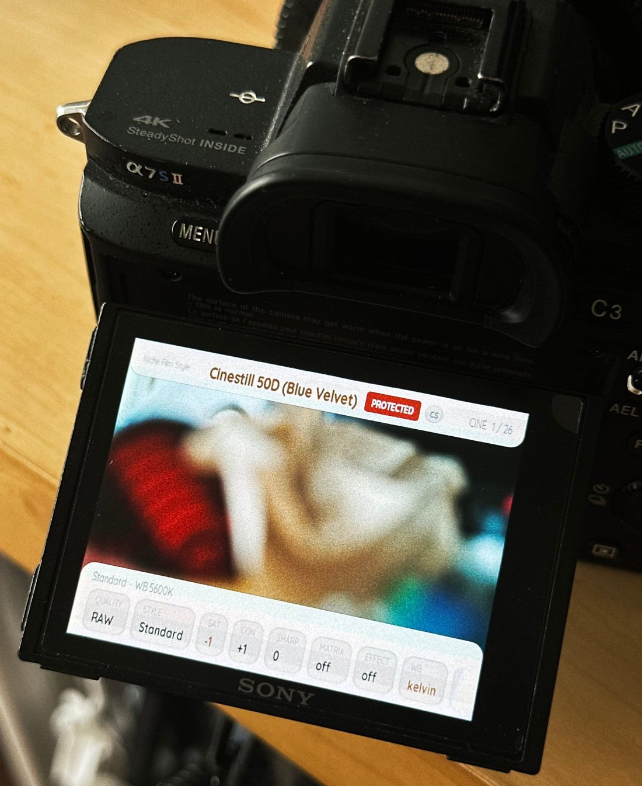
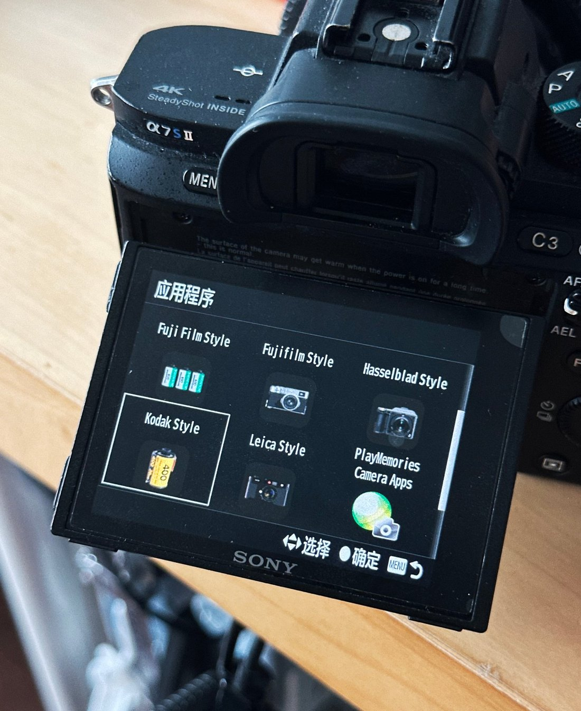
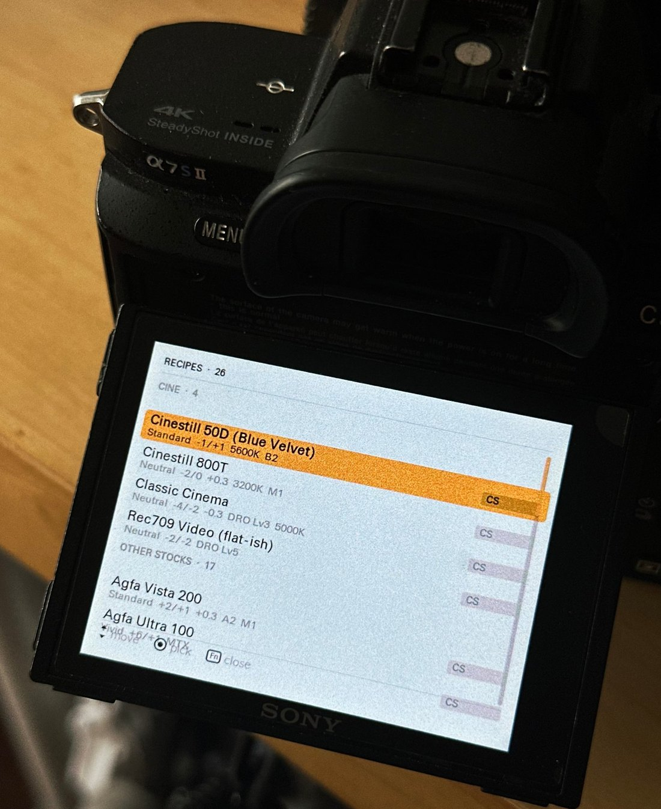
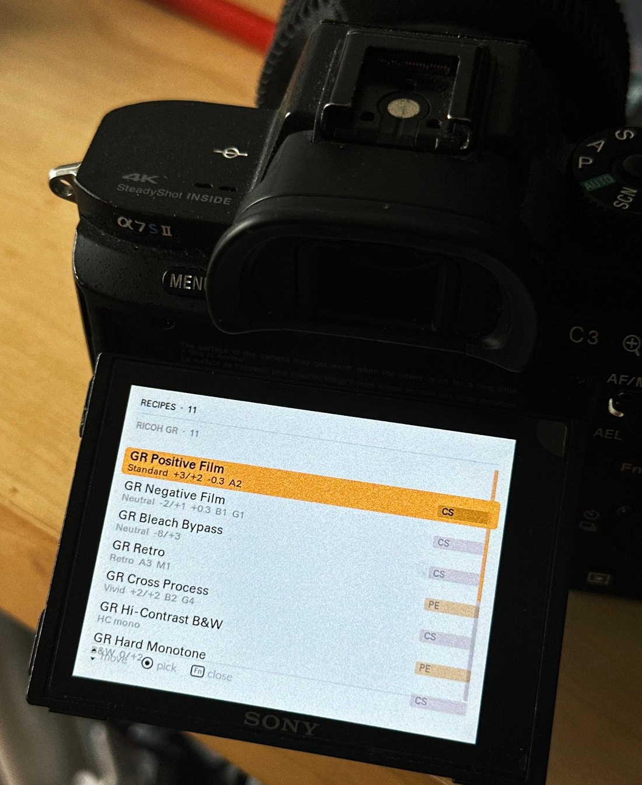

<h1 align="center">sony-sooc-recipes</h1>

<p align="center">
  <b>Turn a Sony camera Sony stopped updating into the cameras you wish it were — Leica, Hasselblad, Fujifilm, Ricoh, Pentax and more — with 164 film and camera looks, straight out of camera.</b>
  <br>
  <sub>164 looks · 149 compiled into the APK · 15 groups — film stocks &amp; other cameras' colour, straight-out-of-camera JPEG</sub>
</p>

<!-- counts: total=164 compiled=149 -->
<!-- The line above is checked against catalog/filters.json by CI. Change the catalog,
     change this line — a mismatch fails the build. Do not reword it. -->

<p align="center">
  <b>English</b> · <a href="README.zh-CN.md">简体中文</a>
</p>

<p align="center">
  <a href="https://github.com/HairuoLiu/sony-sooc-recipes/actions/workflows/ci.yml"></a>
  <a href="https://github.com/HairuoLiu/sony-sooc-recipes/actions/workflows/release.yml"></a>
  <a href="https://github.com/HairuoLiu/sony-sooc-recipes/releases/latest"></a>
  
</p>

<p align="center">
  
  
  <br><sub>
  <b>Left:</b> the Application List — one entry per brand pack, nine of them on one body.
  <b>Right:</b> the screen you land in when you open one — a real look already selected.
  </sub>
</p>

Sony closed its PlayMemories Camera Apps store in 2021, and every body made before late 2016
lost its app channel. Those bodies still run an Android userspace, which means they can still
be given a new personality. This project turns a Sony into the cameras you reach for — a Leica
monochrome, a Hasselblad natural, a Fujifilm colour, a Ricoh GR contrast, a Pentax reversal — and
folds 164 film looks in besides. All of it lands in one APK you install once. If that is more than
you want to scroll through on a 3-inch screen, **ten per-brand APKs ship the same code with only
one camera's looks inside** — install Leica Style and the list reads Leica. After that the look is
not an app running in the background — it is simply what the camera does. Close the app,
power-cycle, and your JPEG comes out graded in **P, A, S, M and video**.

**Language follows the camera.** Put the body into 简体中文 and every recipe name, group
and on-screen label switches to Chinese — the same APK, no separate download to hunt for.
A body left in English stays English.

> **Honest note.** These are approximations, not anybody's colour science. An a6000 has no
> Picture Profile menu and cannot store a tone curve, so each look is assembled from what the
> body can actually hold. **[docs/ARCHITECTURE.md](docs/ARCHITECTURE.md)** is where those
> limits are drawn out — read it if you want to know why something looks the way it does.

---

## Does your camera work?

Press `MENU` and look for an **`Application`** entry.

| It has `MENU → Application` | It does not |
|---|---|
| a6000 · a6300 · a6500 · a5100 · a5000<br>a7 · a7R · a7S · a7 II · a7R II · a7S II<br>NEX-5R · NEX-5T · NEX-6<br>RX100 III / IV / V · RX10 II / III · RX1R II<br>HX60 / HX90 / HX400 · WX500<br>a68 · a77 II · a99 II | a6100 · a6400 · a6600 · a6700 · ZV-E10<br>a7 III and everything after it · a9 · a1<br>RX100 VA and later · RX10 IV · RX0 · HX99 · ZV-1 |

**No `Application` entry means nothing fits, and that is final.** Bodies after late 2016 run
signed firmware. Not this project, not Sony's own store. Reports of this working on an a6400
are misreports.

**Confirmed on a real body: the α7S II** — installs, launches, four packs side by side. Photographs
in [On a real camera](#on-a-real-camera). The rest of the left column is supported by the
platform rather than tested body by body, and the two are not the same claim.

---

## Install

<p align="center">
  
</p>

1. Download an APK from [Releases](https://github.com/HairuoLiu/sony-sooc-recipes/releases) —
   the all-in-one `SonySOOCRecipes.apk`, or a per-brand pack if you only want that brand
   ([docs/BRAND-PACKS.md](docs/BRAND-PACKS.md)).
2. Make sure the body has `MENU → Application`. If it does not, stop.
3. Install over **USB** with [Sony-PMCA-RE](https://github.com/ma1co/Sony-PMCA-RE). Offline, universal, no prerequisites.
4. Open the app, pick a look with the control wheel, store it with the centre button, **power-cycle the body**.

> **Before you install.** CI signs each APK with the key it generates for that build, so a
> new APK **cannot be installed over an existing one**. If the body already has a Sony SOOC
> Recipes from somewhere else, remove it first — [Uninstall](#uninstall).

Detailed walkthrough with per-OS prerequisites and a troubleshooting table:
**[docs/INSTALL.md](docs/INSTALL.md)**. Already have Wi-Fi ADB running? It is faster for
reinstalls, and it can never replace USB — **[docs/CHANNEL-COMPARISON.md](docs/CHANNEL-COMPARISON.md)**
says why in six lines.

**Will it brick my camera?** No firmware is touched and nothing is unlocked: the app writes
values you could set by hand in the body menus, and everything is reversible. It is still
third-party software on hardware with no supported update path — keep a backup of anything
you care about. **[docs/FAQ.md](docs/FAQ.md#safety)** answers the rest.

---

## What's inside

164 looks in 15 groups — film stocks and the colour of other cameras alike. The hook is the
camera simulation: a Sony that shoots like a **Leica**, **Hasselblad**, **Fujifilm**, **Ricoh GR**
or **Pentax**, not just a film stock. **[The filter browser](catalog/index.html)** lists every one,
searchable and filterable — it is a single self-contained HTML file, so download it and open it
locally rather than viewing the source on GitHub.

<details>
<summary>Show all 164 looks, grouped (full table)</summary>

| Group | Count | Representative looks |
|---|---|---|
| **Sony** | 8 | FL (film-like) · IN (instant) · VV2 |
| **Fuji Sim** | 26 | Classic Chrome · Nostalgic Neg · Acros +R |
| **Fuji Film** | 10 | Pro 400H · Reala 500D · Industrial Print 400 |
| **Kodak** | 20 | Portra 400 · Gold 200 · Double-X 5222 · Vision3 · Ektar 25 |
| **Cine** | 4 | Cinestill 800T · Cinestill 50D · Rec709 |
| **Ricoh GR** | 16 | GR Positive Film · High-contrast B&W · Moriyama · Cinema Green/Yellow |
| **Leica** | 20 | Monochrom · M9 CCD · B&W HC · Chrome · Teal |
| **Hasselblad** | 4 | HNCS Natural · LowSat · HiContrast |
| **Canon / Nikon** | 5 | Canon Faithful · Nikon Flat |
| **Pentax** | 11 | Bleach Bypass · Radiant · Reversal Film · Harubeni · Fuyuno |
| **Pana / Olympus** | 4 | L.Monochrome D · Pop Art |
| **Other Stocks** | 17 | Adox · Lomochrome · ORWO · Rollei · Svema · Ambrotype |
| **Ilford** | 5 | HP5 · Delta 3200 · Pan F 50 |
| **Kino LUT** | 9 | Kino Cool 4 … Kino Warm 4 |
| **App Look** | 5 | Toy Camera warm/cool · Part Color red · Posterization · Teal Mood |

**149** of those compile into an APK; the rest are registered by name only. Rather have one
brand than everything? The eleven APKs — the all-in-one plus ten brand packs — are in
**[docs/BRAND-PACKS.md](docs/BRAND-PACKS.md)**, and what each one actually contains is listed
in **[docs/packs/README.md](docs/packs/README.md)**.

</details>

> **Honest note.** Whether a *look* is faithful to the film it imitates is recorded per recipe,
> in the `verified` field of `catalog/filters.json`. Seventy-two were written here and not one
> has been confirmed on hardware yet. The app prints none of that — the marker survives only
> as a comment in the generated source, which is why nothing above says it either. The badge
> on the main screen is the camera's own status: `ACTIVE`, `PREVIEW` or `PROTECTED`.

---

## Using it

Open the app, pick a group, scroll with the control wheel, press the centre button to store,
then power-cycle — some settings only settle after a restart. That is the whole loop.

- **There is no strength slider.** A look is one set of values. To go lighter, edit the values
  in the app before storing, or use a different look.
- **Picture Effect looks need JPEG.** With a Picture Effect active, RAW and RAW+JPEG quietly
  discard the effect.
- **The a5100 has no Fn or AEL button**, so brand-list browsing and the hidden panel are
  unreachable there. The control wheel still reaches every look.

### Two screens

Opening the app gives you the **frosted two-bar main screen** — the look's name centred with
its `CS`/`PE` tag, the camera's own status badge (`ACTIVE` / `PREVIEW` / `PROTECTED`), tuning,
lossless compression and the parameter chips, split into a slim bar above and a slim bar below
so the live view stays visible behind them.

Press **Fn** and you get the **recipe browser**: one white single-column list holding every
look this APK carries, grouped by category. Each row carries its name, a one-line summary of
what it does to the image, and whether it is `CS` or `PE` — Creative Style also applies to
RAW, Picture Effect only reaches JPEG.

| Key | Does |
| --- | --- |
| ↑ ↓ or either dial | move through every look |
| centre button | preview the highlighted look, and close the browser |
| `ENTER` again, back on the main screen | actually store it on the camera |
| Fn · MENU · AEL · DISP | close the browser |

The browser is a separate screen rather than a restyle of the main one: it takes its own
colours from `catalog/ui-theme.json` and leaves the main screen exactly as it was.

---

## Uninstall

<details>
<summary>Show the uninstall steps — and how to put the camera's colours back</summary>


Two different things come off, and removing one does not remove the other: the **app**, and
the **look it stored**. Putting the camera's colours back is a separate step.

```
MENU → Application → Application Management → Manage and Remove → pick the entry → remove
```

On some bodies `Application Management` sits one level deeper, under `Application List`, and
the label is localised. Leave the app first — get back to the shooting screen — rather than
removing it while it is open.

**Sony-PMCA-RE cannot uninstall, and that is not an oversight you can work around.** The tool
that installs these APKs has no uninstall command: its entire command set is `info`,
`install`, `market`, `apk2spk`, `spk2apk`, `firmware`, `updatershell`, `serviceshell`,
`guess_firmware`, `gps`, `stream`, `wifi`, `print_backup`. If that menu item is missing or
greyed out, the route is ADB — turn it on with
[OpenMemories-Tweak](https://github.com/ma1co/OpenMemories-Tweak), then
`adb uninstall com.hairuoliu.sonysoocrecipes` (or `...sonysoocrecipes.<brand>`). The full flow,
and how to reset the stored look, is in **[docs/INSTALL.md](docs/INSTALL.md)**.

</details>

---

## On a real camera

<details>
<summary>Show the photos from a real α7S II</summary>


The two shots at the top of this page are the maintainer's own α7S II. The three below
round it out — the Application List scrolled past the first frame, and the FN browser in
two different packs. None are renders or mockups.

<p align="center">
  
  <br><sub>
  The <b>Application List</b> scrolled — the rest of the nine packs on this body (Kodak Style,
  Leica Style, Hasselblad Style, the Fujifilm and Fuji Film entries, and the PlayMemories
  Camera Apps entry). The first frame is the photograph at the top of this page.
  </sub>
</p>

<p align="center">
  
  
  <br><sub>
  The <b>FN browser</b> — a screen of its own, opened with the <b>Fn</b> key. On the left, the
  Niche Film Style pack: 26 looks, scrolled to its 4-look CINE group. On the right, the Ricoh GR
  Style pack: 11 looks, all of them RICOH GR. Same app, same body, different pack.
  </sub>
</p>

- **The counts on screen are the catalog's.** `CINE · 4` is the catalog's four `cine` recipes,
  and `RECIPES · 26` is the Niche Film Style pack — ilford 5, cine 4, other-stocks 17. The Ricoh
  screen says `RECIPES · 11` because the `ricoh-gr` group's sixteen entries include five that are
  reference-only and compile into nothing; only the eleven that compile reach the camera. That
  split is `catalog/filters.json`, not a rounding.
- **The values on screen are the catalog's.** Cinestill 50D (Blue Velvet) reads
  `Standard · −1/+1 · 5600K B2` — which is `sat −1, con +1, wb 5600K, ab −2` in the catalog. GR
  Positive Film reads `Standard · +3/+2 · A2` against `sat 3, con 2, wb ab 2`.
- **Packs coexist, and you only need one.** Nine brand packs installed side by side on one body.
  That is what the different package names exist to make possible — seen rather than asserted.
  It also means you never have to carry all of them: each pack holds one brand's looks, so the
  browser on the camera stays as short as the brand you actually shoot.
- **The badge says `PROTECTED`.** The camera's settings store was write-protected, so this was
  being *previewed*, not stored; the fix is OpenMemories:Tweak with *Backup protection* off. It
  stays in the crop because it is what the screen said.
- **It does not make the looks verified.** That a *body* runs the app is one claim; a *look*
  being faithful to its film is another, recorded per recipe in `verified`.

</details>

---

## Read next

<details>
<summary>Show where to go next (docs index)</summary>


| If you want to | Go to |
|---|---|
| install step by step, with every prerequisite and a fix for what went wrong | [docs/INSTALL.md](docs/INSTALL.md) |
| know whether it is safe, or ask something nobody has answered yet | [docs/FAQ.md](docs/FAQ.md) |
| carry one brand instead of all of them | [docs/BRAND-PACKS.md](docs/BRAND-PACKS.md) |
| understand how a value reaches the camera's settings store | [docs/ARCHITECTURE.md](docs/ARCHITECTURE.md) |
| see how a `.cube` file becomes ten integers | [docs/LUT-TO-SETTINGS.md](docs/LUT-TO-SETTINGS.md) |
| add a look, or contribute a before/after photo pair | [docs/ADDING-FILTERS.md](docs/ADDING-FILTERS.md) |

Everything here is generated from `catalog/filters.json` and held in place by gates that run
locally and again on every push. That machinery is written down rather than hidden — none of it
is needed to put a look on a camera.

</details>

---

## Origin and licence

<details>
<summary>Show upstream sources and licences</summary>


| Upstream | Contribution | Licence | Redistributed |
|---|---|---|---|
| [voxivoid/recipe-lab-sony-pmca](https://github.com/voxivoid/recipe-lab-sony-pmca) | **77 recipe parameter sets**, the settings-store reverse engineering, the app itself | **MIT** | ✔ |
| [ma1co/Sony-PMCA-RE](https://github.com/ma1co/Sony-PMCA-RE) | the install channel, firmware and settings dumping | MIT | ✘ external tool |
| [ma1co/OpenMemories-Tweak](https://github.com/ma1co/OpenMemories-Tweak) | Wi-Fi ADB and developer toggles | MIT | ✘ external tool |
| [ukiki0718-netizen/sony-a5100-film-studio](https://github.com/ukiki0718-netizen/sony-a5100-film-studio) | names and provenance of 15 looks | PolyForm Noncommercial | ✘ name only |
| [bonyback1/sony-pmca-ricoh-mod](https://github.com/bonyback1/sony-pmca-ricoh-mod) | the hardware matrix + shared gamma method | Apache-2.0 | ✘ reference only |

Brand names in recipe names — Sony, Fujifilm, Kodak, Ricoh, Leica, Hasselblad, Canon, Nikon,
Panasonic, Olympus, Agfa, Ilford, Cinestill, Polaroid, Instax — are trademarks of their
owners, used here only to describe the look a recipe aims at. **This project is not affiliated
with or endorsed by any of them.** Every value is a community-derived approximation, not
official colour science. Full provenance: **[NOTICE.md](NOTICE.md)** ·
**[CHANGELOG](CHANGELOG.md)**.

</details>

---

## Licence

This repository's own code, data structure and documentation: **[MIT](LICENSE)**.

Recipe *values* come from upstream and keep the upstream licence — see [NOTICE.md](NOTICE.md).
Fifteen matrix looks are recorded by name only and are **not** redistributable.
