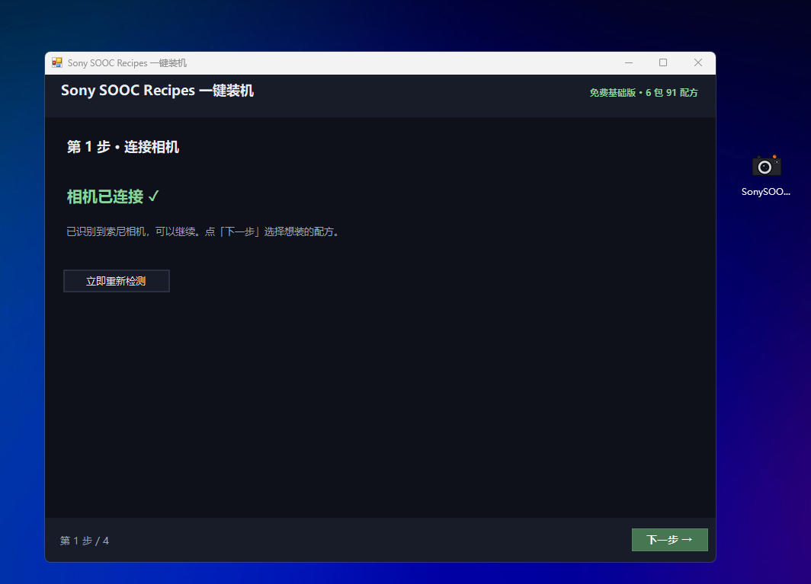
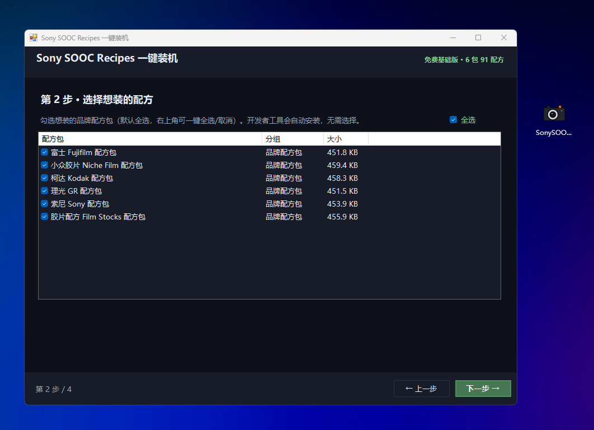
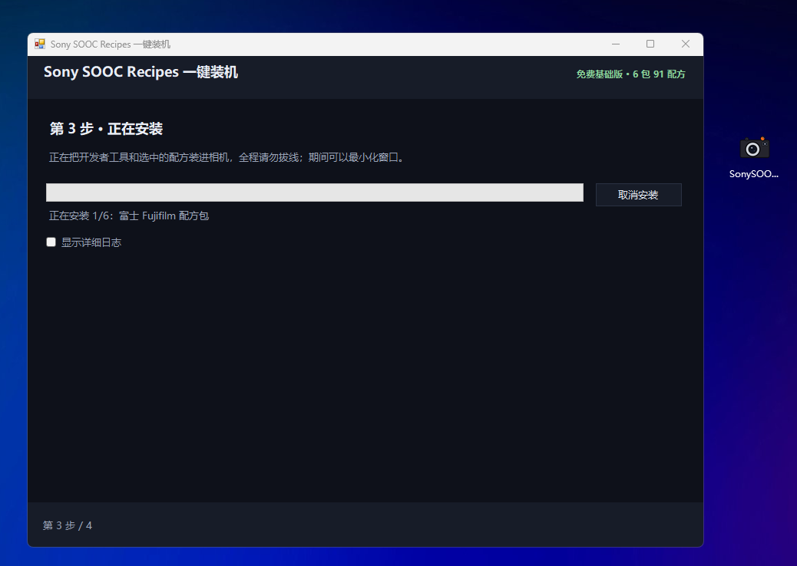
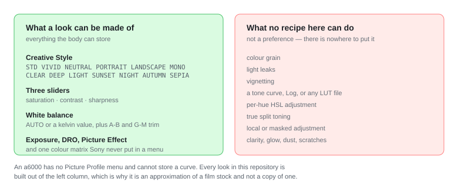
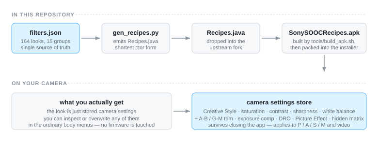

# Sony SOOC Recipes · 索尼直出配方

<p align="center">
  <a href="README.md">English</a> · <b>简体中文</b>
</p>

<p align="center">
  
  
  <br><sub>
  <b>左边：</b>相机上的「应用程序列表」——每个品牌一个条目，一台机身上并排九个。<b>右边：</b>你点进去后落到的主屏，已经选中了一款观感。
  </sub>
</p>

<!-- counts: total=164 compiled=149 -->
<!-- The line above is checked against catalog/filters.json by CI. If you change the
     catalog, update it — a mismatch fails the build. Do not reword it. -->

**把老索尼变成你心心念念的那台相机——莱卡、哈苏、富士、理光、宾得，胶片观感只是顺手带上。**

针对索尼 PlayMemories Camera Apps（PMCA）机型（a6000 · a6300 · a6500 · a5100 · NEX · RX100 III–V · a7 II 一代），一个装进相机内部的应用：**164 款**别家相机色彩与胶片配方，其中 **149 款可装进相机**。

重点不在「164 款胶片」，而在**一台索尼拍出莱卡、哈苏、富士、理光、宾得的味道**——胶片观感是赠品。
关掉应用、关机重启，风格依然是相机在 P/A/S/M 和录像**全部模式**下的默认。直出的 JPEG 就带风格。

**已在真机确认的机型：α7S II** —— 装得上、打得开、九个包同时并存。实拍照片见
[真机实拍](#真机实拍)。支持列表里的其他机型是**平台层面**支持，没有逐台实测过，这两件事不是一回事。

> SOOC = Straight Out Of Camera，直出。
> 这不是「后期套 LUT」，是把风格写进相机，拍的时候就定了。

**语言跟随相机设置。** 把机身语言设为简体中文，配方名、分组名和界面文字会自动切换为中文——
同一个应用，不需要另外下载「中文版」。机身保持英文则仍是英文。

---

## 它解决什么问题

a6000 的直出和屏幕有多难看你心里有数；索尼 2021 年关了应用商店，这批老机器在软件
层面被彻底放弃——但它们有 Android 底层，装得进东西，也**装得进另一台相机的性格**。

本项目的精髓是**机型模拟**：把莱卡、哈苏、富士、理光、宾得的色彩写进你的索尼，让它拍出
那些机器的味道；胶片观感（Portra、Cinestill、HP5……）是同一套机制顺手做的。所有配方汇总成
**一份数据**，再由安装器一次装回去。

一份数据也可以**只装一个品牌**：品牌包共用同一套代码，每个包里只放该品牌的配方——
装 Leica Style，相机上的列表里就只有莱卡。三英寸屏幕上要翻的东西，和你拍的牌子一样少。

---

## 安装

**一个文件，一次点击。不用 APK、不用装工具、不用命令行。**

<p align="center">
  
</p>

1. **下载** `SonySOOCRecipes-Base-CN.exe`：
   [Releases](https://github.com/HairuoLiu/sony-sooc-recipes/releases/latest)。这是**唯一**要下的东西——
   配方和装机通道都在里面。（要英文界面就用 `SonySOOCRecipes-Base-EN.exe`，同一个安装器。）
2. **准备相机** —— 充满电、机内插好 SD 卡、一根**能传数据**的 USB 线，并把相机设为
   `设置（工具箱）→ USB 连接 → 海量存储`。开机插线，等屏幕显示 `USB Mode`。
3. **双击运行安装器，一路点下去。** 它自己认出相机，然后列出它带的配方包（默认全选）；
   不要的取消勾选，点「下一步」。全部约 **10–15 分钟**，窗口可以最小化去干别的。
4. **拔线、关机再开机，开拍。** `MENU → 应用程序 → 应用程序列表` 里每个包一个条目，
   之后风格就是相机自己的行为，**P / A / S / M 和录像**全部模式生效。

<p align="center">
  
  
  
  <br><sub>
  <b>第 1 步 · 连接相机</b> —— 它自己认出机身。<b>第 2 步 · 选择配方</b> —— 它带的包默认全选，
  不要的取消勾选。<b>第 3 步 · 正在安装</b> —— 一条进度条，全部约 10–15 分钟。
  </sub>
</p>

> **不再提供 APK 下载。** 早期版本发布过单品牌 APK，让你自己用 Sony-PMCA-RE 装。那条路已经撤掉：
> 安装器在同一个地方做同一件事，而且「配方预先编译好」才换得来这一次点击。
> 如果你看到哪份教程还在让你下载 `SonySOOCRecipes-<品牌>.apk`，它描述的是一个本仓库**已不再发布**的版本。

> **只支持 Windows。** 安装器是 Windows 程序（Windows 7 SP1 – 11），没有 macOS / Linux 版；
> 预编译的 APK 也不再发布。这两个平台上要走本仓库自己构建——`tools/build_apk.sh` 会把
> `catalog/filters.json` 编成同样的 APK，流程见 **[架构说明](docs/ARCHITECTURE.zh-CN.md)**。

> **装之前先看一眼。** 如果这台机器上已经有别处来的 Sony SOOC Recipes，先删掉——
> 不同 key 签名的应用覆盖不上去。见[卸载](#卸载)。

装的过程中相机会黑屏、切换几次模式，这是正常的：**不要按键、不要拔线**。提示没识别到相机时，
检查线材、海量存储设置和 SD 卡，再点「立即重新检测」。

完整图文步骤、各系统前置条件和排错表见 **[安装指南](docs/INSTALL.zh-CN.md)**。
已经有 Wi-Fi ADB 的，重装时它更快，但它永远取代不了 USB —— 六行说清原因：
**[通道对比](docs/CHANNEL-COMPARISON.md)**。

**会不会变砖？** 不会。不碰固件、不解锁任何东西——写的都是你在机身菜单里本来就能手设的值，
而且都可逆。但它仍然是无人支持的第三方软件：先备份存储卡，
**[常见问题](docs/FAQ.zh-CN.md#安全)** 回答其余的。

---

## 快速开始（改配方的人看这里）

```bash
git clone https://github.com/HairuoLiu/sony-sooc-recipes.git
cd sony-sooc-recipes
python tools/validate_catalog.py     # 校验配方表
python tools/gen_recipes.py --stdout # 看一眼会生成什么
```

**只想把滤镜装进相机？** 看上面的[安装](#安装)就够了。想改配方、加滤镜，
见 **[加一款滤镜](docs/ADDING-FILTERS.zh-CN.md)**。

---

## 三个界面

打开应用**直接就是一条磨砂浮栏**：一个纤薄药囊把整行读数都装下——只有配方名、品牌徽标（宾得 /
柯达 / 徕卡 …；英文 `PENTAX` / `KODAK` / `LEICA` …）和序号三个字段。药囊上下贴着字走——没有竖向
内边距，也没有字体自带的行空——画面其余部分留给实时取景。按 **AEL** 或 **DISP** 循环切换浮层：
浮栏 → 精简胶囊 → 纯取景（屏幕上什么都没有）→ 浮栏。按**上键**从配方名进入参数，当前项会有一个
带描边的胶囊框；**左右键**在参数之间移动。

按 **`Fn`** 进入**配方浏览器**：白色单栏，把这个包里所有配方按类目排成一列滚动。每行给出
配方名、一行摘要，以及 `CS` / `PE` 标签 —— `CS`（Creative Style，创意风格）进 RAW 也生效，
`PE`（Picture Effect，图片效果）只作用于 JPEG。高亮那一行还会带一个**设置** / `SET` 小标签。

| 按键 | 作用 |
| --- | --- |
| ↑ ↓ 或前后拨轮 | 在所有配方之间移动 |
| 中心键 · 右键 | 打开当前配方的设置编辑器 |
| ← · Fn · MENU · AEL · DISP | 关闭浏览器 |

**编辑器**是一个竖向参数列表 —— 左边是参数名、右边**始终**是它当前的数值，单独占一屏，调数值时
画面不被挡。列表用**它自己的轴**来走：**↑ ↓** 在列表里上下移动选中行，**← →**（或前后拨轮）改
选中行的数值，`ENTER` 写入并直接回到纯取景，`Fn` 放弃修改、退回浏览器。这里**不隐藏任何参数**：
被图片特效覆盖的那几项（风格、饱和、反差、锐度、矩阵、强度）照样列出来、灰掉，数值照样可读，
下面标着「（不能改动）」——所以像 GR 高反差黑白这类配方，会显示全部参数行，而不是看起来少了一半。
参数行永远待在中间的框里：列表上方的配方标题和下方的键位图例不会被滚动的行盖住。所有写入路径
最后都会把浮层收起来，不会有东西留在画面上。

浏览器是独立的一屏，不是主屏换了个皮肤：它从 `catalog/ui-theme.json` 取自己的配色，主屏保持原样。

---

## 卸载

<details>
<summary>展开：卸载步骤（以及如何把相机的色彩还回去）</summary>


要卸的是**两样东西**，而且不是一回事：**应用**，和它**存进去的配方**。卸掉应用不会把相机的色彩改回去。

**卸应用** —— 用相机自己的菜单：

```
MENU → Application → Application Management → Manage and Remove → 选中要删的那一项 → 移除
```

部分机型的 `Application Management` 在 `Application List` 下面（多一层），标签是本地化的
（`Manage and Remove` / 中文界面为「管理与移除」）。**先退出应用**、回到拍摄界面再操作，别在应用开着的时候删。

**Sony-PMCA-RE 没有卸载功能，这不是漏做，是它根本没有。** 安装器底层驱动的就是它，而它**没有**
卸载命令——它的全部子命令就这些：`info`、`install`、`market`、`apk2spk`、`spk2apk`、`firmware`、
`updatershell`、`serviceshell`、`guess_firmware`、`gps`、`stream`、`wifi`、`print_backup`。
所以「用装它的工具再把它卸掉」这条路是不存在的。如果你机器上那个菜单项没有、或者是灰的，
退路是 ADB —— 先用 [OpenMemories:Tweak](https://github.com/ma1co/OpenMemories-Tweak) 打开 ADB
（见[安装指南](docs/INSTALL.zh-CN.md)的通道 B），然后按包名卸载：

```bash
adb connect 相机IP:5555
adb shell pm list packages | grep hairuoliu     # 看相机上实际装了哪几个包
adb uninstall com.hairuoliu.sonysoocrecipes     # 或 ...sonysoocrecipes.<品牌>
```

**配方也要还回去。** 卸载应用**不会**回退已经存进相机设置的配方——它仍在 P/A/S/M 和录像下生效。
还回原样：在应用里按 **TRASH** + 中心键，然后关机重启；或 `Setup → Setting Reset → Camera Settings Reset`。

</details>

---

## 真机实拍

<details>
<summary>展开：α7S II 真机实拍照片</summary>


本页顶部的两张是维护者自己机器上的 **α7S II**。下面这三张补全——应用程序列表往下滚过第一帧，以及 FN 浏览器在两个不同包里的样子。都不是渲染图、不是效果图。

<p align="center">
  
  <br><sub>
  <b>应用程序列表</b>往下滚——这台机器上九个包里的其余几个（Kodak Style、Leica Style、
  Hasselblad Style、Fujifilm / Fuji Film 两个入口，以及 PlayMemories Camera Apps 入口）。
  第一帧就是本页顶部的那张。
  </sub>
</p>

<p align="center">
  
  
  <br><sub>
  <b>FN 浏览器</b>——按 <b>Fn</b> 键打开的独立一屏。左边是 Niche Film Style 包：26 款，停在只有 4 款的 CINE 组。
  右边是 Ricoh GR Style 包：11 款，全是 RICOH GR。同一个应用、同一台机身，只是装的包不同。
  </sub>
</p>

- **屏幕上的数字就是 catalog 里的。** `CINE · 4` 对应 catalog 里四款 `cine`；`RECIPES · 26` 是
  Niche Film Style 包本身（ilford 5 + cine 4 + other-stocks 17）。Ricoh 那一屏写 `RECIPES · 11`，
  是因为 `ricoh-gr` 组的 16 条里有 5 条仅供参考、不参与编译，真正进相机的是 11 条——
  这个差值是 `catalog/filters.json` 定的，不是四舍五入。
- **屏幕上的数值就是 catalog 里的。** Cinestill 50D (Blue Velvet) 显示 `Standard · −1/+1 · 5600K B2`，
  对应 catalog 的 `sat −1, con +1, wb 5600K, ab −2`；GR Positive Film 显示 `Standard · +3/+2 · A2`，
  对应 `sat 3, con 2, wb ab 2`。数据与真机之间没有漂移。
- **多个包能并存，但你只需要装一个。** 一台机身上并排放着九个品牌包——这正是"包名必须各不相同"
  要换来的结果，是看见的，不是声称的。反过来它也意味着你不必背着全部九个：每个包只装一个品牌的配方，
  相机上那张列表就和你真正拍的牌子一样短。
- **徽标显示的是 `PROTECTED`，不是 `ACTIVE`。** 那表示相机的设置存储区被写保护，所以当时是**在预览**
  而不是存储——装 OpenMemories:Tweak 关掉 *Backup protection* 即可。这一处**没有裁掉**，
  因为屏幕当时就是这么显示的。
- **它不能证明这些观感是"已验证"的。** 「某台**机身**跑得起来」和「某款**观感**忠实于它模仿的胶片」
  是两件事。后者由 catalog 逐条记录在 `verified` 字段里。

</details>

---

## 配方一览

164 款，15 个组（14 个品牌/胶片组 + 1 个 App Look 组）。重头戏是**机型模拟组**——Leica、Hasselblad、Fuji Sim、Ricoh GR、Pentax、Canon/Nikon、Pana/Olympus，把别家相机的色彩搬进索尼；胶片组（Kodak、Cine、Ilford、Other Stocks）是另一半。完整可筛选的列表打开 **[滤镜浏览器](catalog/index.html)**。
（GitHub 上直接打开是源码，下载后用浏览器打开即可。）

<details>
<summary>展开：全部 164 款配方分组一览表</summary>

| 品牌组 | 数量 | 代表 |
|---|---|---|
| **Sony** | 8 | FL (film-like) · IN (instant) · VV2 |
| **Fuji Sim** | 26 | Classic Chrome · Nostalgic Neg · Acros +R |
| **Fuji Film** | 10 | Pro 400H · Reala 500D · 工业打印 400 |
| **Kodak** | 20 | Portra 400 · Gold 200 · Double-X 5222 · Vision3 · Ektar 25 |
| **Cine** | 4 | Cinestill 800T · Cinestill 50D · Rec709 |
| **Ricoh GR** | 16 | GR 正片 · 高反差黑白 · 森山风 · 电影绿/电影黄 |
| **Leica** | 20 | Monochrom · M9 CCD · 黑白 HC · Chrome · Teal |
| **Hasselblad** | 4 | HNCS Natural · 低饱和 · 高反差 |
| **Canon / Nikon** | 5 | Canon Faithful · Nikon Flat |
| **Pentax** | 11 | 漂白旁路 · 明艳 · 反转片 · 春红 · 冬野 |
| **Pana / Olympus** | 4 | L.Monochrome D · Pop Art |
| **Other Stocks** | 17 | Adox · Lomochrome · ORWO · Rollei · Svema · 湿版 |
| **Ilford** | 5 | HP5 · Delta 3200 · Pan F 50 |
| **Kino LUT** | 9 | Kino 冷调4 … Kino 暖调4 |
| **App Look** | 5 | Toy Camera 暖/冷 · Part Color 红 · Posterization · Teal Mood |

（数量含仅登记的胶片工坊风格；能装进相机的是 149 款。）

**按包拆分。** 免费的 Base 安装器带 **6 个包、91 款**——富士、胶片配方、柯达、小众胶片、
理光 GR、索尼；其余品牌包（徕卡、宾得、哈苏、电影滤镜、单色）以及装了全部配方的全量版单独分发。
想知道每个包里到底含多少款、每一款分别是什么，见
**[docs/packs/README.zh-CN.md](docs/packs/README.zh-CN.md)**。

</details>

---

## 必须先说清楚的限制

**这些是「某个味道的近似」，不是别家色彩科学的复制品。**

a6000 没有 Picture Profile 菜单，也存不下色调曲线。每一款配方只能用这台相机
**存得下来**的东西拼：创意风格、饱和度、对比度、锐度、白平衡与微调、曝光补偿、
DRO、图片效果，外加一个索尼从未在菜单里公开的色彩矩阵开关。

<p align="center">
  
  <br><sub>图：左栏是这台相机存得下的全部维度，右栏是任何配方都做不到的东西</sub>
</p>


**做不到的**（不是没做，是这台机器做不到）：Log 曲线（S-Log / V-Log / Blackmagic）、
带色调的黑白（硒调、蓝晒）、真正的胶片颗粒、索尼摄像机那条 *Cinematone* gamma。

其他已知限制：

- **「强度」旋钮：0–100%（步进 5，默认 100%）。** 它把这款观感的饱和度、对比度、锐度、曝光补偿偏移，按这个比例乘完再送进相机——100% 即作者原值，50% 每一项减半，0% 为中性。这个数值记在 App 自己的设置里，不写入相机存储。
- **PE 类配方要 JPEG**。图片效果开启时相机忽略创意风格，且 RAW / RAW+JPEG 下效果被静默丢弃
- **a5100 少了 Fn 和 AEL 两个键**，品牌列表浏览和隐藏面板用不了，波轮能滚完全部配方
- **本项目不改固件**，不解锁任何东西，只写你本来就能手设的那些值
- 详见 [架构说明](docs/ARCHITECTURE.zh-CN.md)

---

## 项目结构

<details>
<summary>展开：代码结构与 CI 关卡</summary>


```
catalog/filters.json   ★ 唯一事实来源 —— 所有配方都登记在这里
catalog/index.html       可浏览的滤镜浏览器（单文件，无依赖，浅色主题）
docs/                    安装 · 通道对比 · 架构 · 加滤镜流程
tools/                   校验器 · 代码生成器 · 保真比对 · 安装把手 · 构建脚本
```

**数据流**：`catalog/filters.json` →（生成）→ `Recipes.java` →（编译）→ APK →（打进安装器）→ 相机

<p align="center">
  
  <br><sub>图：<code>filters.json</code> 经生成器变成 <code>Recipes.java</code>，编译成 APK、打进安装器，最终写进相机的设置存储区</sub>
</p>


手改 `Recipes.java` 是错的——它随时会被重新生成。要加滤镜，改注册表。
见 **[加一款滤镜](docs/ADDING-FILTERS.zh-CN.md)**。

### 关卡——本地八道，CI 再加一道，另有自测

每次改动都过 `python tests/run_all.py`，CI 里再过一遍。八道关卡在任何环境都能跑；保真检查要拉上游，所以交给 CI 跑。
第九道是**自测**：给每道关卡喂一份它必须拒绝的坏输入，断言它真的会失败——从没见过失败的关卡只是装饰，不是关卡。

| 关卡 | 拦住什么 |
|---|---|
| `validate_catalog.py` | 枚举非法、取值越界、分组顺序断裂、**来源声明不诚实** |
| `tests/test_catalog.py` | 33 个用例：不变量、取值范围、生成器往返、上游 pin 漂移 |
| `tests/test_ui_theme.py` | 25 个用例：磨砂双栏主屏保留 `MainActivity` 绑定的每个 view id、每个引用的 drawable / string 都能解析、每个颜色都是 `#AARRGGBB`——可见性值写错会让 aapt 无法 inflate、启动即崩 |
| `check_fidelity.py` | **某个配方的数值被悄悄改动** —— 全部 77 条上游配方，逐值对照 *(仅 CI)* |
| `gen_recipes.py --check` | 有人手改了 `Recipes.java`，或忘了重新生成 |
| `smoke_browser.js` | 一个会让滤镜浏览器空白出货的拼写错误 |
| `check_readme_counts.py` | README 宣传的数字与 catalog 不再一致 |
| `check_assets.py` | 文档指向一张不存在的图——或指向某人的图床 |
| `check_docs.py` | 英文文档没有中文双生（或双生的原文已消失）、共用图里写死了某种语言、或图里画着的数字已被 catalog 超过 |
| `tests/test_gates.py` | 某道关卡对坏输入不再失败——自测会给每道关卡喂一份它必须拒绝的输入 |

保真比对会把上游 `Recipes.java` 拉下来，双方**展开成完整 15 值形式**后逐个对照
（上游偶尔把默认值写全，必须按语义比对而非文本）。当前状态：

> **77 条上游配方逐值一致，0 漂移。**

</details>

---

## 数据来自哪里

<details>
<summary>展开：数据来源与许可边界</summary>


| 上游 | 贡献 | 许可 | 可否再分发 |
|---|---|---|---|
| [voxivoid/recipe-lab-sony-pmca](https://github.com/voxivoid/recipe-lab-sony-pmca) | **77 款配方参数**、设置存储区反向工程、应用本体 | **MIT** | ✔ |
| [ma1co/Sony-PMCA-RE](https://github.com/ma1co/Sony-PMCA-RE) | 应用安装通道、固件与设置转储 | MIT | ✘ 外部工具 |
| [ma1co/OpenMemories-Tweak](https://github.com/ma1co/OpenMemories-Tweak) | Wi-Fi ADB 与开发者开关 | MIT | ✘ 外部工具 |
| [ukiki0718-netizen/sony-a5100-film-studio](https://github.com/ukiki0718-netizen/sony-a5100-film-studio) | 15 款风格的名称与来源 | PolyForm Noncommercial | ✘ 仅登记 |
| [bonyback1/sony-pmca-ricoh-mod](https://github.com/bonyback1/sony-pmca-ricoh-mod) | 硬件色彩矩阵 + 共同 Gamma 的方法论 | Apache-2.0 | ✘ 仅参考 |

**2026-09-28 核对结论：上游已经往前走，而 pin 是有意为之。** 构建固定在 `6b5c8aa`（2026-09-12，上游
`development` 分支的 `v1.1.0-dev.8`）；voxivoid 此后已发到 **v1.4.0**（2026-09-27）。那边改的是
**数值重调，不是新增风格**：

- **没有增删任何配方。** pin、v1.4.0、以及今天 `main` 上都是同样的 77 条、同样的 12 个组。也没有新增
  宾得组；上游 `Hasselblad` 组至今只有 1 条，而我们这里是 4 条（1 条上游 + 3 条本仓库所写）。
- **77 条里有 21 条被重调**——主要是把在 α7S II 上已经压成死灰的饱和度收回来
  （`−9`/`−8`/`−6` → `−6`/`−4`），并重选创意风格基准（*Classic Chrome* `Neutral −5` → `Standard −1`；
  *Kodak Ultra Max 400* `+3/+1` → `0/0`；*Classic Cinema* `Neutral −4` + `5000 K` →
  `Standard` + `6000 K`）。按组分布：Sony 1、Fuji Sim 6、Fuji Film 2、Kodak 8、Cine 3、Ricoh GR 1。
- **修了 `SEPIA` 枚举**：上游原先猜的 `13` 是错的，真实值 `14`，`13` 改标为未识别，于是存了 `13` 的
  配方不再被显示成「Sepia」。

**这 21 处重调不在本次构建里。** catalog 复刻的是**被 pin 住的那个版本**，所以这些包出的仍是
v1.2.0 之前的数值。`tools/check_fidelity.py` 比对的是同一个 pinned SHA，因此它报 **0 漂移** ——
这是构造上必然的绿，并不等于我们与上游最新版一致。是否移植这 21 条是**一个需要做的决定**（它会改变
这 21 款配方在机身上的表现）。

**没有 ma1co 就没有这一切。** 他公开地反向工程了索尼的 PlayMemories 平台并给出了
宽松许可——本项目只是站在上面。

**筛选与许可边界见 [NOTICE.md](NOTICE.md)。** 简版：

- 本仓库**自己的代码**是 MIT
- 上游 `recipe-lab` 的配方参数是 MIT，可自由再分发
- 胶片工坊的 15 款**只登记名称与来源，不转录其拟合参数**——许可（非商用）与技术
  （数值是给它的矩阵/Gamma 管线拟合的，放进「写设置」的引擎根本不成立）两重原因
- 那 15 款里，上游项目唯缺的是理光**森山风**，本仓库补写了近似版 `gr-moriyama`，
  标着 `verified: false`（**未在实机验证**）

**本项目与索尼、富士、柯达、理光等公司无任何关联，未获其背书。**

</details>

---

**品牌包（Brand packs）**：每个品牌一份独立应用，包名不同、可并存于相机侧，各自带该品牌相机的
启动图标。见 [docs/BRAND-PACKS.zh-CN.md](docs/BRAND-PACKS.zh-CN.md)。

## 免责声明

**这是个人非官方项目，与任何厂商都无关联。** 它不由索尼制作、认可、赞助或批准，也与配方名或包名里
出现的富士、柯达、徕卡、哈苏、理光、宾得、佳能、尼康、松下、奥林巴斯、伊尔福、CineStill 等品牌无关。
所有商标归各自所有者；这里出现这些名字，只是为了说明某款配方**想模仿什么**。

- **配方是近似，不是任何一家的色彩科学。** 它们来自社区与个人推导；模仿某款胶片或某台相机时是**用眼睛**
  对的——`catalog/filters.json` 里的 `verified` 字段记录了哪些**连真机都还没验过**。没有人拿它们和
  它们所命名的那个东西做过实测比对。
- **包名写成 `<Brand> Style` 是降低风险，不等于获得授权。** 用商标给应用命名**本身就是商标使用**。
  完整理由、以及这么做**换不到**什么，见 [docs/BRAND-PACKS.zh-CN.md §8](docs/BRAND-PACKS.zh-CN.md)。
- **第三方软件、无任何担保，而且机身本就没有官方更新路径。** 本项目不碰固件、不解锁任何东西——只写你
  本来就能手设的值——但它仍然是无人支持的软件。先备份存储卡，先用可丢弃的素材试拍，**风险自负**。
- **你若转发这些应用，风险随之转移给你。** 图标是用户提供的、保留全部权利的图片，名字是商标；再发布这些
  包（或把它们打包进别的产品）是你的选择，也是你的风险。

来源与许可：**[NOTICE.md](NOTICE.md)** · 图标：`assets/app-icon-packs/CREDITS.md`。

---

## 授权

本仓库代码 MIT。**本项目不改固件**，只写相机设置存储区里你本来就能手设的值。

装任何东西前先备份存储卡，先用可丢弃的素材试拍。软件按现状提供，
不保证兼容性、色彩准确性或无侵权。
