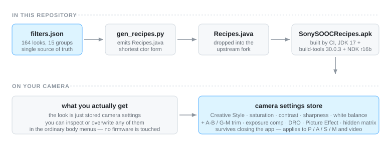
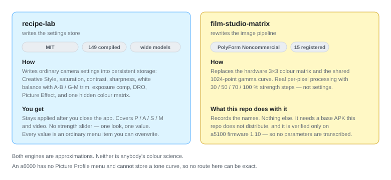

# 架构：为什么这样设计，以及它能做到什么、做不到什么

<p align="center"><a href="ARCHITECTURE.md">English</a> · <b>简体中文</b></p>

> **实话实说。** 这个项目不复制别家的色彩科学。它把「胶片风格配方」汇总成一份数据，编译成
> APK，装进 2016 年末以前的索尼微单（a6000 / a6300 / a6500 / a5100 / NEX / RX100 III–V / a7 II）。
> 下面每一个风格，都是**只用相机存得下来的设置拼出来的近似**——不是某个 LUT、Log 曲线或别家
> 色彩矩阵的复制品。在下结论之前，请先读 [§5](#5-引擎天花板--这台相机做不到什么)。

本文解释这套架构：两套引擎、一条配方到底往相机里写了什么、硬件的硬天花板、数据模型、CI 关卡，
以及**为什么**项目是这个形状。如果你只是想加一款滤镜，去读 [`docs/ADDING-FILTERS.md`](ADDING-FILTERS.md)。

---

## 1. 这段在干嘛

这一节帮你定位。文件其余部分是参考：读完你应该明白，一份 JSON 怎么变成十年前那块传感器上的
颜色，以及这条路的终点在哪。

本仓库共有 **155 款配方**，分 **14 组**、走 **两套引擎**：

- **140 款**会编译进 App（引擎 `recipe-lab`）：其中 **77 款**逐值抄自开源上游项目，**63 款**
  由本仓库自写（含相机模拟、胶片、品牌包与手机 App 风几个批次）。
- **15 款**是「只登记」的条目（引擎 `film-studio-matrix`）：只记名字，不编译、不写参数。

---

## 2. 全景：数据从注册表流到相机的设置存储区

这一节用一张图把整条路径讲完。唯一的真相来源是 `catalog/filters.json`，它下游的一切都从它生成。

<p align="center">
  
  <br><sub>图：数据从注册表到相机设置存储区的路径</sub>
</p>

```
catalog/filters.json
        │
        │  tools/gen_recipes.py
        ▼
build/recipe-lab-sony-pmca/src/com/hairuoliu/sonysoocrecipes/Recipes.java
        │
        │  tools/build_apk.sh  →  上游 build.sh
        │  (JDK 17 + Android SDK build-tools 30.0.3 + platform API 28 + NDK r16b)
        ▼
SonySOOCRecipes-<tag>.apk          ──  签名密钥只在本机，永不入库
        │
        │  Sony-PMCA-RE (USB)   或   adb install -r (Wi-Fi)
        ▼
相机设置存储区  ──  关机重启后依然生效
```

**手改 `Recipes.java` 是错的。** 它随时可重新生成，且会被 CI 判为过期。要改配方，改的是
`catalog/filters.json`。

---

## 3. 两套引擎，两种完全不同的原理

这一节是最重要的一件事：**两个上游项目改的不是同一个东西**，不是同一种技巧的两个口味。

<p align="center">
  
  <br><sub>图：写设置的引擎 vs. 改硬件矩阵的引擎</sub>
</p>

| | 上游项目 | 胶片工坊 / Film Studio |
|---|---|---|
| 作者 | [voxivoid](https://github.com/voxivoid/recipe-lab-sony-pmca) | [ukiki0718-netizen](https://github.com/ukiki0718-netizen/sony-a5100-film-studio) |
| 改什么 | **相机持久化设置存储区**：创意风格 + 饱和度/对比度/锐度、白平衡与微调、曝光补偿、DRO、图片效果，外加一个索尼从未在菜单公开的色彩矩阵开关 | 机内**图像处理管线**：3×3 硬件色彩矩阵 + 1024 点共同 Gamma 曲线 |
| 本质 | 等于「帮你飞快地在菜单里设好一堆值」 | 真正的逐像素色彩处理 |
| 生效范围 | 关机重启后依然是相机默认，**P/A/S/M 与录像全模式**，应用关着也生效 | 拍照与实验性录像，带 **30 / 50 / 70 / 100%** 四档强度 |
| 强度档位 | 无（一组固定值） | ✅ 四档 |
| 机型覆盖 | a6000 / a6500 / a5100 / a7 II 已实机验证（据 `catalog`）；覆盖全部 PMCA 机型 | **只有 a5100 固件 1.10** |
| 依赖 | 无额外依赖 | 需要一个**不随仓库分发**的基础 APK（bonyback1 的 Ricoh 模组，基于索尼「照片效果+」） |
| 许可 | **MIT** | **PolyForm Noncommercial 1.0.0**（非 OSI 开源，禁止商用）+ 富士/索尼权利独立保留 |
| 能否再分发 | ✅ 可以 | ❌ 不能 |

### 为什么本项目以「上游项目」为引擎

1. **许可干净**：MIT，可以自由 fork、再分发、发布 APK。
2. **覆盖面广**：一个 APK 覆盖全部 PMCA 机型，而不是绑死一台固件。
3. **可生成**：77 款配方就是 Java 数组里的 77 行，天生适合从数据生成。
4. **可反复安装**：不依赖任何需要单独获取的基础 APK，不存在「你自己去找个 base.apk」的法律灰区。

胶片工坊的路线更「硬核」——色彩矩阵是真处理——但它绑死一台固件、需要一个不分发的
基础 APK、且许可是非商用。所以本仓库把它作为**参考目录**收录（见 [§6](#6-数据模型--一条配方长什么样)），
不作为引擎。

> **实话实说。** 那 15 款胶片工坊风格只登记「名字与取向」。它们的拟合参数一律不转录进本仓库——
> 不只是因为许可，更因为那些数值是为另一条管线（矩阵 + Gamma）拟合的，放进写设置的引擎里
> 根本不成立。`validate_catalog.py` 会在 `film-studio` 条目一旦带上 `recipe` 对象时直接报错。

---

## 4. 配方到底改了什么

这一节逐项列出 `recipe-lab` 配方写入的每一个字段，以及相机（或上游引擎）真正强制的合法范围。
这些范围直接来自 `tools/validate_catalog.py`。

| 字段 | 合法范围 | 作用 |
|---|---|---|
| `style` | `STD` `VIVID` `NEUTRAL` `PORTRAIT` `LANDSCAPE` `MONO` `CLEAR` `DEEP` `LIGHT` `SUNSET` `NIGHT` `AUTUMN` `SEPIA` | 创意风格（存下来的枚举） |
| `sat` `con` `sharp` | −16…+16 | 创意风格滑块。菜单只到 ±3；相机会接受更大值，但屏幕滑块会吸附到最近的菜单值，手碰一下就丢掉了额外的力度 |
| `matrix` | `0` \| `1` | `1` = 备用（PP3）色彩矩阵，约 +45% 色度并带蓝/绿串扰。只在 `VIVID` `CLEAR` `DEEP` `LIGHT` `SUNSET` `NIGHT` `AUTUMN` 上生效 |
| `wb.mode` | `AUTO` \| `K` | `AUTO` 时 `kelvin` 必须为 `0`；`K` 设定色温 |
| `wb.kelvin` | 2500…9900 | 色温（Kelvin，仅 `wb.mode = "K"` 时） |
| `wb.ab` `wb.gm` | −7…+7 | 白平衡微调：`ab` 琥珀(+)/蓝(−)，`gm` 绿(+)/品红(−) |
| `pe` | `0`…`13` | 图片效果（运行时索引）。**`pe != 0` 时相机会忽略创意风格并禁用 RAW——只用 JPEG** |
| `sub` | 视 `pe` 而定 | 图片效果子参数。`pe=0` 强制 `sub=0`。只有 `pe` ∈ {1,3,5,6} 有子参数（数量 5/2/3/4） |
| `ev` | −5…+5 | 曝光补偿，1/3 EV 步进（持久化） |
| `dro` | `0`…`6` | DRO：`0` 关 / `1`–`5` 档位 / `6` 自动（持久化） |

### 你必须记住的一条引擎行为

> **实话实说。** `pe != 0` 时，相机会**忽略创意风格**——于是 `sat` / `con` / `sharp` 和 `matrix`
> 虽然写进去了但没有可见效果，并且 RAW 会被静默丢弃。带 `pe` 的配方只能拍 JPEG。这是上游相机的
> 既有行为，不是本仓库的 bug；`validate_catalog.py` 遇到这种情况只给一条 `note`（不是 error）。

---

## 5. 引擎天花板：这台相机做不到什么

这一节故意不修饰。你最需要的是边界，不是好话。根子在硬件：a6000 **没有 Picture Profile 菜单**，
存不下任何色调曲线。一款配方只能用这台机器存得下来的东西拼。

**所有风格都是近似，不是复制品。** 具体而言，通过这些机型与这套引擎，以下都做不到：

- **Log 曲线**（S-Log、V-Log、Blackmagic Film、Cinelike D）——存不下色调曲线。
- **带色调的黑白**（硒调、蓝晒）——只有全局 `ab`/`gm`，无法针对影调。
- **索尼摄像机那条 *Cinematone* gamma**——固件里有，但 a6000 的相机层既不列出也不接受。
- **真实（彩色）颗粒**——设置存储区里没有叠加层。`pe=7`（粗颗粒黑白）只在黑白下伪造「颗粒感」。
- **漏光 / 真正的暗角叠加**——暗角只有走 `pe=1` 玩具相机才出现，而它会强制带自己的偏色；没有独立的漏光层。
- **LUT 文件**——相机完全不支持 LUT。
- **HSL 分通道**——只有一个全局饱和度滑块加一个全局 `ab`/`gm` 偏移。
- **真·青橙分色调**——只有单一全局 `ab`/`gm` 偏色；可以伪造青调（见 `teal-mood`），但做不出真正的双色调曲线。
- **局部处理**——这条引擎没有任何区域感知能力。
- **带图片效果或矩阵风格的 RAW**——RAW / RAW+JPEG 会静默丢弃它们，只用 JPEG。

> **实话实说。** 如果你想要的效果需要上面任何一项，这台相机 + 这套引擎给不了。这就是天花板，
> 直说以免你白拍一场才发现。

---

## 6. 数据模型：一条配方长什么样

这一节展示 `catalog/filters.json` 的形状，并给出三条真实条目（数值逐字取自文件，未编造）。

### 顶层字段

| 字段 | 说明 |
|---|---|
| `version` | 注册表格式版本 |
| `engines` | 两套引擎的说明、限制与许可 |
| `sources` | 每个上游的作者、许可、取得版本、可否再分发 |
| `style_constants` / `pe_constants` / `dro_constants` | 存下来的枚举（来自上游反向工程） |
| `groups` | 品牌分组，**顺序即 APK 内的分组顺序** |
| `filters` | 全部滤镜 |

### 单条滤镜

| 字段 | 必填 | 取值 | 说明 |
|---|---|---|---|
| `id` | ✔ | kebab-case，全表唯一 | 生成器与文档的引用键 |
| `name` | ✔ | 字符串 | 相机应用里显示的名字 |
| `name_zh` | | 字符串 | 中文名，仅供浏览器显示 |
| `group` | ✔ | `groups[].id` 之一 | 分组 |
| `engine` | ✔ | `recipe-lab` \| `film-studio-matrix` | 见 §3 |
| `source` | ✔ | `recipe-lab` \| `authored-here` \| `film-studio` | 来源 |
| `tone` | ✔ | `color` \| `mono` | 浏览器筛选用 |
| `verified` | ✔ | `true` \| `false` | **是否已在真机上验证** |
| `cross_ref` | | 另一个 `id` | 跨引擎的对应款 |
| `note` | | 字符串 | 浏览器里显示的备注 |
| `recipe` | recipe-lab 需要 | 对象 | 参数（见 §4） |
| `strengths` | film-studio 需要 | `[30,50,70,100]` | 四档强度 |

`film-studio-matrix` 条目**不允许**带 `recipe` 字段——`validate_catalog.py` 会直接报错。

### 真实例子——一条极简的 recipe-lab 配方（全零基线）

```json
{
  "id": "factory-st", "name": "FACTORY (ST)", "name_zh": "出厂标准",
  "group": "sony", "engine": "recipe-lab", "source": "recipe-lab",
  "tone": "color", "verified": true,
  "recipe": { "style": "STD", "sat": 0, "con": 0, "sharp": 0, "matrix": 0,
              "wb": { "mode": "AUTO", "kelvin": 0, "ab": 0, "gm": 0 },
              "pe": 0, "sub": 0, "ev": 0, "dro": 6 }
}
```

### 真实例子——白平衡微调 + 曝光补偿，仍走创意风格

```json
{
  "id": "kodak-gold-200", "name": "Kodak Gold 200", "name_zh": "柯达金 200",
  "group": "kodak", "engine": "recipe-lab", "source": "recipe-lab",
  "tone": "color", "verified": true,
  "recipe": { "style": "STD", "sat": 2, "con": 1, "sharp": 0, "matrix": 0,
              "wb": { "mode": "AUTO", "kelvin": 0, "ab": 3, "gm": 1 },
              "pe": 0, "sub": 0, "ev": 1, "dro": 6 }
}
```

### 真实例子——开启矩阵开关 + 跨引擎对应款

```json
{
  "id": "velvia", "name": "Velvia", "group": "fuji-sim",
  "engine": "recipe-lab", "source": "recipe-lab", "tone": "color",
  "verified": true, "cross_ref": "fs-velvia",
  "recipe": { "style": "VIVID", "sat": 5, "con": 1, "sharp": 0, "matrix": 1,
              "wb": { "mode": "AUTO", "kelvin": 0, "ab": 0, "gm": 0 },
              "pe": 0, "sub": 0, "ev": 0, "dro": 6 }
}
```

### 真实例子——一条 film-studio-matrix 条目（只登记名字，无参数）

```json
{
  "id": "fs-provia", "name": "PROVIA", "group": "fuji-sim",
  "engine": "film-studio-matrix", "source": "film-studio", "tone": "color",
  "verified": true, "cross_ref": "provia",
  "strengths": [30, 50, 70, 100],
  "note": "富士 GFX ETERNA 55 v1.10 LUT 拟合的 3x3 矩阵 + 1024 点 Gamma。100% 保留上游参数。"
}
```

### 分组顺序是有约束的

`recipe-lab` 条目**必须按 `groups` 声明的顺序连续排列**——生成器据此产出
`GROUP_START` / `GROUP_COUNT` 静态块，断了就直接报错。`film-studio-matrix` 条目可以和同品牌的
`recipe-lab` 条目交错（它们不参与编译），反而让浏览器里每个品牌更集中。

---

## 7. 管道与关卡：从改一个数字到发布 APK

这一节把一次改动从 `filters.json` 追到签名 APK，并点名每一道能拦下它的关卡。共 **6 道 CI 关卡**，
外加发布构建。

| # | 关卡 | 脚本 | 拦住什么 |
|---|---|---|---|
| 1 | 注册表合法 | `validate_catalog.py` | 枚举值写错、数值越界、分组连续性断裂、许可声明不诚实、`film-studio` 条目带参数 |
| 1b | 自写配方用例 | `tests/test_catalog.py` | `authored-here` 的配方在 `tests/cases.json` 里没有钉死值，或值与用例漂移。`TestAuthoredHaveCases` 规定自写条目没 case 就跑不过 |
| 3 | 保真 | `check_fidelity.py` | **某个配方数值被悄悄改动**，导致 APK 拍出来的颜色和上游不一致。逐值比对，并展开成完整 15 值形式，使简写拼写一致 |
| 4 | 浏览器 | `gen_browser.py` + `tests/smoke_browser.js` | 单文件浏览器里的拼写错误会发出空白页；`catalog/index.html` 过期也会失败 |
| 5 | README 计数 | `check_readme_counts.py` | README 的配方计数与注册表对不上 |
| 6 | Assets | `check_assets.py` | 文档里指向不存在的图片；从第三方主机外链图片（状态徽章除外——徽章是按请求实时生成的，固化其中一个会冻结构建状态）；`docs/assets/samples/` 下文件名不按 `<recipe-id>--off.jpg` / `--on.jpg` 命名、且该 id 存在于注册表 |

顺序：

1. 你改 `catalog/filters.json`（绝不要改 `Recipes.java`）。
2. 每次 push/PR 到 `catalog/`、`tools/`、`tests/` 时跑关卡 1 + 1b。
3. 关卡 3 拉取上游 `Recipes.java`，逐值比对保真。
4. `gen_recipes.py` 重新生成 `Recipes.java`，产物作为 artifact 上传供检视。
5. 关卡 4 重新生成并对浏览器做冒烟测试。
6. 关卡 5 核对 README 计数。
7. 关卡 6 扫描所有 README 与 `docs/*.md` 里的图片引用，遇到指向不存在的文件、第三方外链
   （状态徽章除外）、或 `docs/assets/samples/` 下命名错误的样例时失败。
8. 推送 `v*` tag 时，`release.yml` 重跑关卡 1+1b，然后按**固定的 `UPSTREAM_SHA`** 克隆上游、
   改包名、把 `assets/app-icon/` 里的启动图标拷进 fork、重新生成、用 JDK 17 + build-tools 30.0.3
   + NDK r16b 构建，并把 `SonySOOCRecipes-<tag>.apk` 与 SHA-256 校验和挂到 GitHub Release。

> **实话实说。** 上游版本固定在**两处**——`catalog/filters.json`（`sources.recipe-lab.fetched_rev`）
> 和 `release.yml`（`UPSTREAM_SHA`）——而且 `test_catalog.py`（`TestPinnedUpstream`）会在两处不一致时
> 失败。一个 tag 必须构建在它被验证过的那个上游版本上；不固定版本，下个月可能构建出不同的 APK。

---

## 8. 仓库布局

这一节把目录树列出来，方便对应上面的路径。

```
sony-sooc-recipes/
├── assets/app-icon/          启动图标集——透明 RGBA，4 个密度 + 512 px 主图
├── catalog/
│   ├── filters.json          ★ 唯一事实来源。所有配方都登记在这里
│   ├── index.html            可浏览的滤镜浏览器（单文件，无依赖）
│   └── README.md             字段说明
├── docs/
│   ├── INSTALL.md                  双通道安装
│   ├── INSTALL.zh-CN.md            中文安装说明
│   ├── ARCHITECTURE.md             英文版（本文件）
│   ├── ARCHITECTURE.zh-CN.md       中文版
│   ├── ADDING-FILTERS.md           加滤镜的完整流程
│   ├── ADDING-FILTERS.zh-CN.md     中文版
│   ├── FAQ.md                      常见问题
│   ├── FAQ.zh-CN.md                中文常见问题
│   ├── CHANNEL-COMPARISON.md       USB vs Wi-Fi ADB，含结论
│   ├── MAPPING-RECIPES.md          把想要的风格映射到相机可复现的设置
│   ├── LUT-TO-SETTINGS.md          一个 .cube 怎么变成配方，以及过程中丢了什么
│   └── assets/                     配图 + README（architecture.svg、engines.svg、parameters.svg、install-flow.svg）
├── tools/
│   ├── validate_catalog.py   校验注册表（CI 关卡 1）
│   ├── gen_recipes.py        注册表 → Recipes.java（CI 关卡 2 步骤）
│   ├── check_fidelity.py     与上游逐值比对（CI 关卡 3）
│   ├── gen_browser.py        生成浏览器（CI 关卡 4）
│   ├── check_readme_counts.py 核对 README 计数（CI 关卡 5）
│   ├── check_assets.py       文档图片 / 资源引用（CI 关卡 6）
│   ├── install-wifi.sh       Wi-Fi ADB 安装把手
│   ├── build_app_icon.py     按源照片重新生成启动图标集
│   └── build_apk.sh          调上游 build.sh 并套用生成的 Recipes.java 与图标
├── tests/
│   ├── test_catalog.py       33 条用例 + 不变量（CI 关卡 1b）
│   ├── cases.json            自写配方的钉死值
│   └── smoke_browser.js      浏览器冒烟测试（CI 关卡 4）
├── .github/workflows/
│   ├── ci.yml                六道关卡
│   └── release.yml           推 tag 自动构建 APK 挂 Release
├── LICENSE                   MIT（本仓库代码）
└── NOTICE.md                 上游归属与许可边界
```

---

## 9. 为什么这样设计

这一节解释两个不显然的决策：单一事实来源，以及**不入库**的生成物。

**单一事实来源。** 配方过去总丢，因为大家手改上游 fork 里的 `Recipes.java`。让 `catalog/filters.json`
成为唯一可以定义一款配方的地方，意味着只有一份东西要改、要审、要信。生成器是 `Recipes.java`
**唯一的写手**。

**生成物不入库。** `Recipes.java` 和 APK 都是构建产物。提交它们会让它们与注册表漂移——而 CI 的
关卡 1b / 关卡 3 正是为了抓这种漂移而存在。生成的 Java 在 CI（以及本地按需）产出并作为 artifact
上传；APK 只由 `release.yml` 产出并挂到 GitHub Release，从不入库。签名密钥只在本机，永不入库。

**来源诚实是「测出来」的，不是「写出来」的。** MIT（上游项目，逐值抄录、由保真检查锁死）与
PolyForm Noncommercial（胶片工坊，只记名字）之间的那条线，是一个**测试**，不是一段话。模糊它
是本仓库唯一会变得不宜托管的错误，所以 `validate_catalog.py` 与 `test_catalog.py` 会为此让构建失败。
