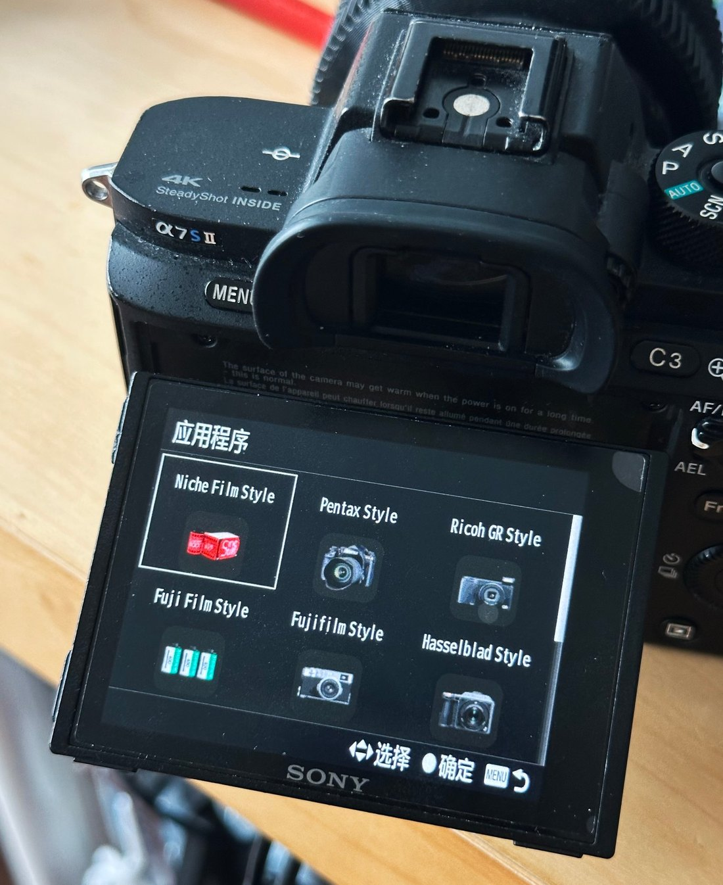

# Installation: putting film recipes on your Sony camera

<p align="center">
  <b>English</b> · <a href="INSTALL.zh-CN.md">简体中文</a>
</p>

This guide walks you through installing **Sony SOOC Recipes** — an app that writes a catalog of
film-style recipes (Creative Style, Picture Effect, white balance, DRO…) into your camera,
so older Sony bodies can produce film-like output straight out of the camera.

**What this takes:** about 10–15 minutes for the first run over USB, plus a couple of minutes
if you have never installed any app on your camera before. Channel B (Wi-Fi ADB) is only for
later, repeated reinstalls and takes seconds each time.

Read [CHANNEL-COMPARISON.md](CHANNEL-COMPARISON.md) first if you want to understand *why* there
are two paths. The short version: **first install goes through Channel A; open Channel B only
when you need to iterate.**

<p align="center">
  
  <br><sub>Figure: the complete path from downloading the APK to having it in your camera</sub>
</p>

---

## Before you start

### Confirm your camera is supported

Press `MENU` and look for an **`Application`** entry. If it is there, your camera uses the
PlayMemories Camera Apps (PMCA) channel and can receive apps. If it is not, stop here — no
method in this repository can install anything on it.

| Has `MENU → Application` | Does not |
|---|---|
| a6000 · a6300 · a6500 · a5100 · a5000<br>a7 / a7R / a7S / a7 II / a7R II / a7S II<br>NEX-5R · NEX-5T · NEX-6<br>RX100 III / IV / V · RX10 II / III · RX1R II<br>HX60 / HX90 / HX400 · WX500<br>a68 · a77 II · a99 II | Pre-2012 NEX (NEX-3 / 5 / 5N / F3 / 3N / **7**) · a3000 · a3500<br>a6100 · a6400 · a6600 · a6700 · ZV-E10<br>a7 III and everything after · a9 series · a1 series<br>RX100 VA and after · RX10 IV · RX0 · HX99 · ZV-1 series |

> **Honest note.** "No `Application` menu" means you cannot install apps, full stop. Sony shut
> down its own app store in 2021, and every body from late 2016 onward (a6500 and a99 II were
> the last two) ships signed firmware that rejects apps — not just this project, Sony itself
> cannot load apps onto them. Reports of people running this on an a6400 are mistaken.
>
> There is a boundary on the other end too: **PMCA starts with the autumn-2012 NEX-5R / NEX-6.**
> The earlier NEX-7, NEX-3 / 5 / 5N / F3, and the a3000 / a3500 have no Android subsystem and
> no `Application` menu either — their absence from the supported column above is **not an omission**.

**Confirmed on a real body: the α7S II**, with four brand packs installed side by side. Photographs
of it running are in the [README](../README.md#on-a-real-camera). Everything else in the left
column is *platform* support — the body has the app channel — rather than a body-by-body test,
and those are not the same claim.

### What you need

- A computer (Windows, macOS, or Linux).
- A **data-capable USB cable** (a6000 uses micro-USB; the charging-only wire in a 3-in-1 kit
  will not work).
- A **memory card** inserted in the camera.
- A **fully charged battery.** Installation toggles the camera's mode a few times. If power
  dies mid-install, recovery is unpleasant — charge first.

### Get the APK

Download from the project's Releases page:

https://github.com/HairuoLiu/sony-sooc-recipes/releases

A release carries **one APK per brand pack, plus the all-in-one app**. They are the same app
built from the same catalog; what differs is which groups of looks a pack carries, its
Android package name (that is what lets several sit side by side on the camera), and its
launcher icon. The full list and the reasoning are in [BRAND-PACKS.md](BRAND-PACKS.md).

| If you want | Install |
|---|---|
| Everything, and to browse the whole catalog | `SonySOOCRecipes-<version>.apk` |
| One brand's looks only | `SonySOOCRecipes-<brand>-<version>.apk` |

The current release is `v0.6.0`. A pack is only a few KB smaller than the all-in-one — the
recipe data is the smallest thing in the APK, the engine is most of it. The point of a pack
is fewer looks to step through, not a smaller download. The repository publishes only the
recipe data and build tooling; the APKs are produced by CI from `catalog/filters.json`. If
no release exists yet, build them yourself — see [ARCHITECTURE.md](ARCHITECTURE.md).

> **Honest note.** Three things actually bite people:
>
> 1. **The signing key is single-use.** CI has no keystore configured, so every build generates
>    a fresh key. APKs signed with *different* keys **cannot overwrite** each other — if your
>    camera already has a Sony SOOC Recipes from somewhere else, remove it in the camera first, then
>    install this one. This applies to packs too: `SonySOOCRecipes-leica` and the all-in-one are
>    *different packages* and install side by side, but two copies of the same one do not.
> 2. **Everything this repository wrote itself is unverified on real hardware** — that is 63
>    of the 155 recipes today, and it is written per recipe by the `verified` field in
>    `catalog/filters.json`, which `tools/gen_recipes.py` turns into a
>    `// NOT VERIFIED ON HARDWARE` comment in the generated `Recipes.java`. Try those on
>    discardable footage before trusting them on something you cannot reshoot. The marker is
>    a source comment, not a label the app draws; see the [FAQ](FAQ.md) for what the badge on
>    the main screen actually means.
> 3. **Several packs do not give you several cameras.** The camera's settings store is
>    shared, and only one recipe can be active at a time. Packs differ in what they *ship*,
>    not in what the camera can *do*.
>
> The version number shown inside the app is the **base app's** version, not this repository's
> tag. The base app reads its version from `AndroidManifest.xml`; this repo only swaps the
> recipe table. Trust the release tag, not the in-app number.

---

## Channel A: USB + Sony-PMCA-RE

**This is the path every first-time install should take.** Fully offline, exposes no network
service, works on every PMCA body, and requires no pre-installed app.

### 1. Get the installer, Sony-PMCA-RE

This is ma1co's tool. It uses the very same channel Sony's own app store used to push apps into
the camera.

- **Windows:** download `pmca-gui.exe` from
  [ma1co/Sony-PMCA-RE releases](https://github.com/ma1co/Sony-PMCA-RE/releases). No install —
  just run it. You also need the USB driver; install it per ma1co's README
  (https://github.com/ma1co/Sony-PMCA-RE).
- **macOS:** the same page has a macOS build, though it is less tested than Windows. **Close
  every app that grabs the USB device first** (Photos, Image Capture, Dropbox, Google Drive…),
  or they snatch the camera before the installer can.
- **Linux:** use the Python source (also installs the libraries, including `libusb`):
  ```bash
  git clone https://github.com/ma1co/Sony-PMCA-RE.git
  cd Sony-PMCA-RE && pip install -r requirements.txt
  ```
  Platform-specific driver/permission details follow ma1co's README; if `libusb` or device
  permissions misbehave, that README is the authority.

> **Honest note.** Exact driver and permission steps differ per OS and can change. When in
> doubt, follow ma1co's README: https://github.com/ma1co/Sony-PMCA-RE

### 2. Prepare the camera

1. Charge the battery and **insert the memory card**.
2. `Setup (the toolbox icon) → USB Connection → **Mass Storage**`.
3. Power on, plug in the USB cable (a6000 is **micro-USB**; use the wire in the 3-in-1 kit that
   actually transfers data).
4. The screen shows **USB Mode** — you are ready.

> **Honest note.** If you later follow Channel B, this setting changes to **MTP**. Keep it on
> Mass Storage for Channel A.

### 3. Install

**Graphical interface:** open `pmca-gui.exe` → **Install app from file** → select the APK → wait.

**Command line** (prefix with `sudo` on Linux):
```bash
python pmca-console.py install -f SonySOOCRecipes-<version>.apk
```

The camera will blank to black and switch modes a few times — **this is normal, do not press
anything.** After about a minute the computer prints `Task completed successfully`.

> **Honest note.** **Trust the computer's output.** The camera usually sits on an
> `Application Download / Connecting via USB...` screen that looks frozen. It is not.

### 4. Finish

Unplug, **power off and on again.** The app now lives at
`MENU → Application → Application List → Sony SOOC Recipes`.

---

## Verify it worked

1. Open `MENU → Application → Application List` and confirm **Sony SOOC Recipes** is listed.
2. Launch it. You should see a recipe list; turning the dial changes the live preview
   immediately.
3. To confirm a recipe is really written into the camera: pick a recipe, press the **center
   button** to store it, then **power off and on.** The style now applies as the camera's
   default in **every** mode (P/A/S/M and movie), even with the app closed.

Badges you may see in the app:

| Badge | Meaning |
|---|---|
| `ACTIVE` | These values are already in the camera |
| `PREVIEW` | Just previewing; press center to save |
| `PROTECTED` | The camera's setting storage is write-protected — install [OpenMemories-Tweak](https://github.com/ma1co/OpenMemories-Tweak) and turn off *Backup protection* |

---

## Channel B: Wi-Fi ADB

**Only use this after Channel A works and you need to reinstall repeatedly.** It is the
developer fast lane, not something an end user needs.

> **Honest note.** While ADB is on, any machine on the same LAN can run `adb` commands against
> your camera. Turn it on only on a trusted network and turn it off the moment you are done —
> see the Security note in [CHANNEL-COMPARISON.md](CHANNEL-COMPARISON.md).

### 1. Install OpenMemories:Tweak via Channel A first

Set the camera USB mode to **MTP** (not Mass Storage), connect, open `pmca-gui`:

1. Go to the **Install app** tab.
2. Pick **OpenMemories: Tweak** from the list.
3. Click **Install selected app**.

No firmware update or service mode needed.

### 2. Enable ADB on the camera

1. Safely disconnect USB, open **OpenMemories: Tweak** from
   `MENU → Application → Application List`.
2. Connect the camera to a Wi-Fi access point first.
3. In Tweak's **Developer** page, enable **Enable Wifi** and **Enable ADB**, and **note the IP
   shown**.
4. Put the computer on the same LAN; lengthen the camera's sleep timer.

> **Honest note.** This app needs only ADB. You do **not** need Telnet, setting protection
> off, region change, record-limit removal, or firmware modification.

### 3. Install over ADB

```bash
adb connect CAMERA_IP:5555      # replace with the camera's shown address, keep :5555
adb devices                     # the target should show as "device"
adb -s CAMERA_IP:5555 install -r SonySOOCRecipes-<version>.apk
```

The repository also ships a helper: `tools/install-wifi.sh <apk> <camera-ip>` — it connects,
checks readiness, installs, and reminds you to shut ADB down afterward.

### 4. Finish

```bash
adb disconnect CAMERA_IP:5555
```

**Then go back into Tweak and turn ADB off.** `adb disconnect` only drops the computer's side;
the daemon on the camera keeps running until you disable it in Tweak.

---

## Updating and uninstalling

- **Update over USB (Channel A):** just run the install again.
- **Update over ADB (Channel B):** `adb install -r` is near-instant.
- **Signature warning (important):** because CI signs with a throwaway key, an APK signed with
  a *different* key cannot overwrite an existing install. If you see
  `INSTALL_FAILED_UPDATE_INCOMPATIBLE`, either rebuild with the same key or **uninstall the
  same-package-name app first** (see *Uninstall* below; uninstalling clears the app's stored
  settings), then reinstall.
- **Uninstall:** the camera's own menu, not the installer.
  `MENU → Application → Application Management → Manage and Remove` → pick the entry → remove.
  On some bodies `Application Management` sits one level deeper, under `Application List`, and
  the label is localised (`Manage and Remove` / 管理与移除). Leave the app first. This clears
  the app's stored settings.

<p align="center">
  
  <br><sub>What it looks like on an α7S II: <b>Application Management</b> (应用程序管理) is an
  entry <i>in</i> the Application List, not behind another submenu on this body. That is the one
  to open. A photograph of the real screen, not a mockup.</sub>
</p>

> **Honest note — the tool that installed it cannot remove it.** Sony-PMCA-RE has **no uninstall
> command**. Its complete command set is `info`, `install`, `market`, `apk2spk`, `spk2apk`,
> `firmware`, `updatershell`, `serviceshell`, `guess_firmware`, `gps`, `stream`, `wifi`,
> `print_backup` — `install` is the only direction it goes. So if the camera's
> `Manage and Remove` item is missing or greyed out on your body, run the uninstall over ADB
> (Channel B) instead:
>
> ```bash
> adb connect CAMERA_IP:5555
> adb shell pm list packages | grep hairuoliu     # which packs are on the body
> adb uninstall com.hairuoliu.sonysoocrecipes     # or ...sonysoocrecipes.<brand>
> ```

> **Honest note.** Uninstalling the app does **not** automatically revert a recipe you already
> stored into the camera's settings. To go back to stock: in the app press TRASH + center,
> then power-cycle; or `Setup → Setting Reset → Camera Settings Reset`.

---

## Troubleshooting

| Symptom | Likely cause | What to do |
|---|---|---|
| `This camera does not support apps`, right after `Switching to app install mode` | The camera **refused** the "switch to app-install mode" USB command — its firmware has no app channel. The installer only relays that refusal; the wording is its own. Note the preceding `Switching to app install mode` line is printed **before** the command, so it is not a success message, and this failure returns before the APK is transferred — the APK is never sent. | Nothing on the APK side to fix. Press `MENU` and look for `Application`. If it is missing, the body cannot run apps at all — see the model list and the 2012 boundary in `docs/FAQ.md`. If the model *is* in the supported column and it still errors (rare), check in order: `Setup → USB Connection` set to **Mass Storage** (not PC Remote) · camera Wi-Fi / Ctrl with Smartphone off · memory card inserted · quit anything that grabs the USB driver (Photos / Dropbox / Imaging Edge); if it still fails on Windows, install the libusb-win32 driver with Zadig and rerun `pmca-console install -d libusb -f <your.apk>`. |
| `No devices found` | USB not in **Mass Storage**, no card, camera off, or wrong cable/port | Set Mass Storage, insert card, power on to **USB Mode**, try another cable/port |
| Driver won't install (Windows) | Missing/blocked USB driver | Follow ma1co's README driver steps: https://github.com/ma1co/Sony-PMCA-RE |
| Stuck at `Waiting for camera to switch...` | Mid-handshake glitch | Unplug, power cycle the camera, reconnect, rerun |
| Badge shows `PROTECTED` | Setting storage write-protected | Install OpenMemories-Tweak, turn off *Backup protection*, retry |
| Installed but can't find the app | Looking in wrong menu | It is at `MENU → Application → Application List → Sony SOOC Recipes` |
| App won't open / `no live preview: ...` | Another program holds the camera | Quit Photos/Image Capture/etc., reopen the app |
| Stored a recipe but no effect | Camera hasn't re-read settings | **Power off and on** |
| Garbled text `·` | Old APK build | Install the latest release APK |
| `adb: offline` / timeout / no device | Camera slept, IP changed, not same Wi-Fi, ADB off, or guest-network/VPN isolation | `adb disconnect` then reconnect; check guest isolation, VPN, and terminal local-network permission |
| MTP works but `adb` can't find it | MTP and Wi-Fi ADB are **two different connections** | Enable ADB per Channel B step 2 |
| `INSTALL_FAILED_UPDATE_INCOMPATIBLE` | Different signing key | Same key rebuild, or uninstall the same-package app first (clears settings) |
| RAW not affected by effect | Picture Effect recipes (marked **PE**) apply only to **JPEG** | Use JPEG quality; RAW / RAW+JPEG silently drops the effect |
| Saturation slider "drops a notch" when touched | Some recipes push saturation beyond the menu range (±3) | Menu shows the closest value; re-store from the app to keep the extra punch |

---

## FAQ

**Will this brick my camera?**
No. The app writes settings through Sony's official app channel; it does not touch firmware or
bootloader.

**Does it modify the firmware?**
No. Nothing in this process flashes or alters firmware. The signed-firmware bodies in the
"Does not" column simply cannot receive apps at all.

**Is it still there after a factory reset?**
A recipe you stored lives in the camera's settings. `Setup → Setting Reset → Camera Settings
Reset` clears it; a full initialization clears it too. The app itself is removed by
uninstalling.

**Does it affect RAW files?**
Picture Effect class recipes (marked **PE** in the app) only take effect in **JPEG** output; on
RAW or RAW+JPEG the camera silently ignores them. Other recipes (Creative Style, white balance,
DRO) are camera settings and apply regardless of file format.

**Is it reversible / safe for warranty?**
It uses the same channel Sony's store used and uninstalls cleanly. Whether it affects warranty
is a question for Sony; the install mechanism itself is non-destructive and removable.
