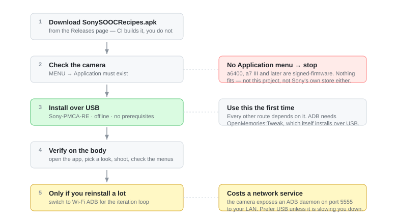

# 安装：把胶片配方装进你的索尼相机

<p align="center">
  <a href="INSTALL.md">English</a> · <b>简体中文</b>
</p>

这份指南带你把 **Sony SOOC Recipes** 装进相机——这个应用会把一整份胶片风格配方（Creative Style、
Picture Effect、白平衡、DRO……）写进你的相机，让你的老索尼微单直出就有胶片味。

**预计耗时：** 第一次走 USB 约 10–15 分钟，加上你从没在相机上装过任何东西时的几分钟准备。
通道 B（Wi-Fi ADB）只在之后反复重装时用，每次几秒。

想先弄明白*为什么*有两条路，先读 [通道对比](CHANNEL-COMPARISON.md)。简版结论：**第一次装走
通道 A，需要反复重装再开通道 B。**

<p align="center">
  
  <br><sub>图：从下载 APK 到装进相机的完整路径</sub>
</p>

---

## 开始之前

### 确认你的相机支持

按 `MENU` 找 **`Application`（应用程序）** 这一项。有，说明你的相机走 PlayMemories Camera
Apps（PMCA）通道，能收应用；没有，就到此为止——本仓库没有任何办法能给它装东西。

| 有 `MENU → Application` | 没有 |
|---|---|
| a6000 · a6300 · a6500 · a5100 · a5000<br>a7 / a7R / a7S / a7 II / a7R II / a7S II<br>NEX-5R · NEX-5T · NEX-6<br>RX100 III / IV / V · RX10 II / III · RX1R II<br>HX60 / HX90 / HX400 · WX500<br>a68 · a77 II · a99 II | a6100 · a6400 · a6600 · a6700 · ZV-E10<br>a7 III 及之后全部 · a9 全系 · a1 全系<br>RX100 VA 及之后 · RX10 IV · RX0 · HX99 · ZV-1 全系 |

> **实话实说。** 没有 `Application` 菜单 = 装不了，句号。索尼 2021 年就关了自家应用商店，
> 2016 年末之后的机型（a6500、a99 II 是最后两台）全是签名固件，任何应用都进不去——不是本项目
> 不行，索尼自己也不行。网上说在 a6400 上跑起来的都是误传。

### 你需要准备

- 一台电脑（Windows / macOS / Linux 都行）。
- 一根**能传数据**的 USB 线（a6000 是 micro-USB；三合一数据线里只有能传数据的那根能用）。
- 相机里**插好存储卡**。
- **充满电的电池。** 安装过程中相机会切几次模式。装到一半没电，恢复起来很难看——先充。

### 拿到 APK

从本仓库的 Releases 下载 `SonySOOCRecipes-<版本>.apk`：

https://github.com/HairuoLiu/sony-sooc-recipes/releases

（当前发布是 `SonySOOCRecipes-v0.5.0.apk`，约 102 KB。本仓库只发布配方数据和构建工具；APK 由 CI
依据 `catalog/filters.json` 生成。若还没有发布版本，见 [架构说明](ARCHITECTURE.md) 自行构建。）

> **实话实说。** 两条会真咬人的：
>
> 1. **签名用的一次性 key。** CI 没配 keystore，每次构建临时生成一把。用不同 key 签的 APK
>    **无法覆盖安装**——如果相机上已经装过别处来的 Sony SOOC Recipes，得先在相机里把它删掉再装这个。
> 2. **有 7 款配方没上机验证过**：`gr-moriyama`、`kodak-vision2-500T`、Toy Camera 暖/冷、
>    Part Color 红、Posterization、Teal Mood。它们在相机里显示为 `NOT VERIFIED`。先在可丢弃的
>    素材上试，别拿去拍不能重来的东西。
>
> APK 里显示的版本号是**基础应用**的，不是本仓库的 tag。基础应用从 `AndroidManifest.xml` 读版本，
> 本仓库只替换配方表；认 tag 就行。

---

## 通道 A：USB + Sony-PMCA-RE

**这是所有人第一次安装都应该走的通道。** 全程离线，不暴露任何网络服务，对所有 PMCA 机型通用，
且不需要任何前置应用。

### 1. 拿到安装器 Sony-PMCA-RE

这是 ma1co 做的工具，用索尼自家应用商店同一条通道把应用写进相机。

- **Windows**：从 [ma1co/Sony-PMCA-RE releases](https://github.com/ma1co/Sony-PMCA-RE/releases)
  下载 `pmca-gui.exe`。免安装，直接运行。你还需要装 USB 驱动，按 ma1co 的 README 来：
  https://github.com/ma1co/Sony-PMCA-RE。
- **macOS**：同一页面有 macOS 版，测试程度不如 Windows。**先关掉所有会占用 USB 设备的程序**
  （照片、图像捕捉、Dropbox、Google Drive 等），否则相机会被它们先抢走。
- **Linux**：用 Python 源码（同时装好依赖，含 `libusb`）：
  ```bash
  git clone https://github.com/ma1co/Sony-PMCA-RE.git
  cd Sony-PMCA-RE && pip install -r requirements.txt
  ```
  驱动和权限等平台细节以 ma1co 的 README 为准；若 `libusb` 或设备权限出问题，那份 README 是
  权威来源。

> **实话实说。** 各系统的驱动、权限步骤不同，也可能随版本变化。不确定时，以 ma1co 的 README
> 为准：https://github.com/ma1co/Sony-PMCA-RE

### 2. 设置相机

1. 电池充满，**装上存储卡**
2. `Setup（工具箱图标）→ USB Connection → **Mass Storage**`
3. 开机，插上 USB 线（a6000 是 **micro-USB**，三合一数据线里只有能传数据的那根能用）
4. 相机屏幕显示 **USB Mode** 即为就绪

> **实话实说。** 之后走通道 B 时这个设置要改成 **MTP**。通道 A 期间保持 Mass Storage。

### 3. 安装

**图形界面**：打开 `pmca-gui.exe` → **Install app from file** → 选 APK → 等待

**命令行**（Linux 前加 `sudo`）：
```bash
python pmca-console.py install -f SonySOOCRecipes-<版本>.apk
```

过程中相机会闪黑、自己切换模式几次——**这是正常的，不要按任何键**。约一分钟后电脑
打印 `Task completed successfully`。

> **实话实说。** **以电脑的输出为准。** 相机通常停在 `Application Download / Connecting via
> USB...` 的界面上，看起来像卡死，其实不是。

### 4. 收尾

拔线，**关机再开机**。应用现在位于 `MENU → Application → Application List → Sony SOOC Recipes`。

---

## 装上之后怎么验证成功

1. 进 `MENU → Application → Application List`，确认列出了 **Sony SOOC Recipes**。
2. 打开它。你会看到配方列表；转波轮时实时画面立刻变化。
3. 确认配方真的写进去了：选一个配方，按**中心键**存下，然后**关机再开机**。这个风格就成了
   相机在 P/A/S/M 和录像**所有模式**下的默认，应用关着也生效。

应用里你可能会看到的徽标：

| 徽标 | 含义 |
|---|---|
| `ACTIVE` | 相机里已经是这些值 |
| `PREVIEW` | 只是在看，按中心键才会保存 |
| `PROTECTED` | 相机设置存储区被写保护——装 [OpenMemories-Tweak](https://github.com/ma1co/OpenMemories-Tweak) 关掉 *Backup protection* |

---

## 通道 B：Wi-Fi ADB

**只在通道 A 已打通、且你需要反复重装时才用。** 它是开发快车道，不是给终端用户准备的。

> **实话实说。** ADB 打开期间，同一局域网内任何机器都能对相机执行 adb 命令。只在可信网络上
> 开，用完立刻关。见 [通道对比 §安全提示](CHANNEL-COMPARISON.md#安全提示)。

### 1. 先用通道 A 装上 OpenMemories:Tweak

相机 USB 模式设为 **MTP**（注意不是 Mass Storage），接上电脑，打开 `pmca-gui`：

1. 选 **Install app** 页
2. 在应用列表里选 **OpenMemories: Tweak**
3. 点 **Install selected app**

不需要用固件更新或服务模式。

### 2. 在相机上开 ADB

1. 安全断开 USB，在 `MENU → Application → Application List` 打开 **OpenMemories: Tweak**
2. 相机先配好 Wi-Fi 接入点
3. 进 Tweak 的 **Developer** 页，打开 **Enable Wifi** 和 **Enable ADB**，**记下显示的 IP**
4. 电脑连同一个局域网，把相机休眠时间调长

> **实话实说。** 本应用只需要 ADB。**不用**开 Telnet、不用解除设置保护、不用改地区、不用解除
> 录制时限、不用改固件。

### 3. 用 adb 安装

```bash
adb connect CAMERA_IP:5555      # 换成相机此刻显示的地址，保留 :5555
adb devices                     # 目标应显示为 device
adb -s CAMERA_IP:5555 install -r SonySOOCRecipes-<版本>.apk
```

仓库自带一个把手：`tools/install-wifi.sh <apk> <相机IP>`，会做连接、就绪检查、安装、并提醒你
收尾关掉 ADB。

### 4. 收尾

```bash
adb disconnect CAMERA_IP:5555
```

**再去 Tweak 里关掉 ADB。** `adb disconnect` 只断开电脑这一侧，相机上的守护进程还在跑。

---

## 更新与卸载

- **USB 更新（通道 A）**：直接再跑一次安装即可。
- **ADB 更新（通道 B）**：`adb install -r` 秒级完成。
- **签名警告（重要）**：因为 CI 用一次性 key 签名，不同 key 签的 APK **无法覆盖安装**。若看到
  `INSTALL_FAILED_UPDATE_INCOMPATIBLE`，要么用同一密钥重建，要么**先在相机应用管理里卸载同包名
  旧应用**（卸载会清掉应用设置），再重装。
- **卸载**：在相机应用管理里移除本应用。这会清掉应用自己的设置。

> **实话实说。** 卸载应用**不会**自动回退你已经存进相机设置的配方。换回原样：应用里按
> TRASH + 中心键 + 关机重启；或 `Setup → Setting Reset → Camera Settings Reset`。

---

## 排错表

| 现象 | 可能原因 | 怎么办 |
|---|---|---|
| `This camera does not support apps` | 相机**拒绝**了「切到应用安装模式」这条 USB 命令——它的固件里没有应用通道。安装器只是转述这次拒绝，这句英文是安装器自己的说法。 | APK 侧没有任何可修的地方。按 `MENU` 看有没有 `Application`；没有的话这台机器根本装不了应用，机型清单见 `docs/FAQ.zh-CN.md`。 |
| `No devices found` | USB 不是 **Mass Storage**、没插卡、相机没开，或线/口不对 | 设成 Mass Storage、插卡、开机显示 **USB Mode**、换线换口 |
| 驱动装不上（Windows） | USB 驱动缺失/被拦 | 按 ma1co 的 README 装驱动：https://github.com/ma1co/Sony-PMCA-RE |
| 卡在 `Waiting for camera to switch...` | 握手中途抽风 | 拔线，相机关机再开，重连，重跑 |
| 徽标显示 `PROTECTED` | 设置存储区写保护 | 装 OpenMemories-Tweak，关掉 *Backup protection*，重试 |
| 装完找不到应用 | 找错菜单 | 它在 `MENU → Application → Application List → Sony SOOC Recipes` |
| 应用打不开 / `no live preview: ...` | 有别程序占着相机 | 退出照片/图像捕捉等，重开应用 |
| 存了但风格没生效 | 相机还没重读设置 | **关机再开机** |
| 文字显示 `·` | 旧版本 | 装最新 Release 的 APK |
| `adb: offline` / 超时 / 找不到设备 | 相机休眠、IP 变了、不在同一 Wi-Fi、ADB 没开，或访客网络隔离/VPN/终端本地网络权限 | `adb disconnect` 后重连；检查访客网络隔离、VPN、终端本地网络权限 |
| MTP 正常但 adb 找不到 | MTP 和 Wi-Fi ADB 是**两条不同的连接** | 按通道 B 第 2 步开 ADB |
| `INSTALL_FAILED_UPDATE_INCOMPATIBLE` | 签名不同 | 用同一密钥重建；或备份后在相机应用管理里卸载同包名旧应用（**卸载会清掉应用设置**） |
| RAW 套不上效果 | Picture Effect 类配方（应用里标 **PE**）只在 **JPEG** 画质下生效 | 用 JPEG 画质；RAW / RAW+JPEG 会被相机静默丢弃 |
| 饱和度滑块一碰就「掉档」 | 部分配方把饱和度推得比菜单滑块范围（±3）更远 | 菜单显示最接近的值，你一动滑块它就弹回正常范围；从应用里重新存储即可 |

---

## FAQ

**会不会变砖？**
不会。应用走索尼官方应用通道写设置，不碰固件、不碰 bootloader。

**会不会动固件？**
不会。整个过程不刷写、不修改固件。右边「不支持」列表里那些签名固件机型，根本就收不到任何应用。

**清掉出厂设置还在吗？**
你存进去的配方活在相机设置里。`Setup → Setting Reset → Camera Settings Reset` 会清掉它；
完整初始化也会清掉。应用本身靠卸载移除。

**RAW 会受影响吗？**
Picture Effect 类配方（应用里标 **PE**）只在 **JPEG** 输出下生效；RAW 或 RAW+JPEG 时相机会
静默忽略它。其余配方（Creative Style、白平衡、DRO）是相机设置，与文件格式无关都会生效。

**可逆吗？影响保修吗？**
它走的是索尼商店同一条通道，可以干净卸载。是否影响保修是索尼说了算；安装机制本身是非破坏性、
可移除的。
